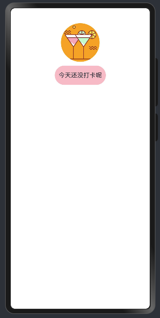
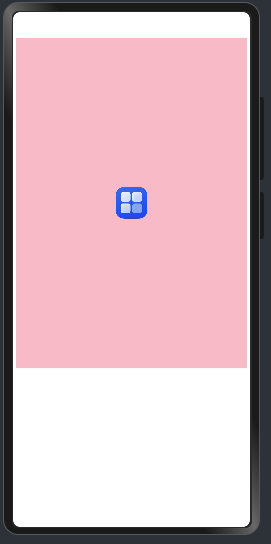
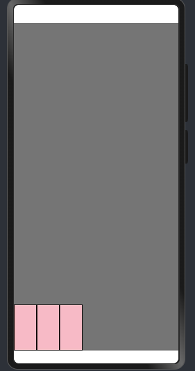
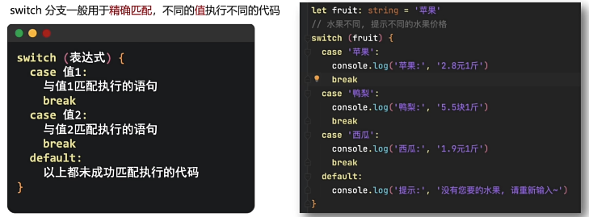
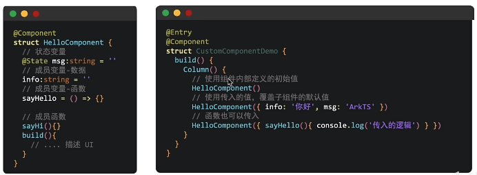

# 全网首发黑马程序员鸿蒙 HarmonyOS NEXT星河版零基础入门到实战，零基础也能快速入门鸿蒙开发教程

## 03-ArkTS-认识和存储数据

```ets
let title: string = 'Hello World!! ';
console.log('字符串:',title);

let num: number = 18;
console.log('数字:',num);

let bool: boolean = true;
console.log('布尔:',bool);

let und: undefined = undefined;
console.log('undefined:',und);

let nul: null = null;
console.log('null:',nul);

let arr: Array<number> = [1,2,3];
console.log('数组:',arr);
```

## 04-ArkTS-常量和变量的命名规则

> 命名规则：
> - 只能包含**数字、字母、下划线、$**，不能以数字开头 （比如 Let、const）
> - 不能使用内置关键字或保留字（比如 Let、const）
> - 严格区分**大小写**

## 05-ArkTS-数组

示例

```ets
// 数组类型
const names:string[] = ['Han', 'Li1'];
console.log('数组:',names);
// 数组索引
console.log('数组:',names[0]);
```

## 06-ArkTS-函数的基本使用

1 定义函数
```ets
function start(){
    console.log('*');
    console.log('**');
    console.log('***');
    console.log('****');
    console.log('*****');
}
```

2 使用函数
```ets
start（）;
```

## 07-ArkTS-函数的完整写法
传入参数并返回结果
```ets
function buy(price : number, count : number){
  let total =price * count;
  return total;
}
console.log('购买商品总价格:',buy(100,2));
```
## 08-ArkTS-箭头函数
箭头函数是比普通函数更简洁的一种函数写法
```ets
//无传参
let stars = () => {
  console.log('这是箭头函数');
  console.log('*');
  console.log('**');
  console.log('***');
  console.log('****');
  console.log('*****');
}
stars();

//传参
let buyIt = (price : number, count : number) => {
  let total =price * count;
  return total;
}
console.log('(这是箭头函数)购买商品总价格:',buyIt(100,2));
```
## 09-ArkTS-接口&对象
1. 通过 interface 接口约定对象结构类型
2. 定义对象并使用
```ets
//定义对象
interface Person{
  name:string;
  age:number;
}
//使用对象
let person:Person = {name:'Han',age:18};
console.log('对象:',person.name,person.age);
```
## 10-ArkTS-对象方法
```ets
//定义接口
interface Person{
  name:string;
  age:number;
  sing:(song : string)=>void;
  dance:()=>void;
}
//接口实现
let person: Person = {
  name: 'Han',
  age: 18,
  sing: (song: string): void => {
    console.log('正在唱：',song);
  },
  dance: (): void => {
    console.log('正在跳舞');
  }
};
//对象方法调用
person.sing('爱的供养')
person.dance()
```

## 11-ArkTS-联合类型
联合类型是一种灵活的数据类型，它修饰的变量可以存储**不同类型**的数据。
> 语法 let name: string | number;

示例
```ets
let judge:number | string ;
judge = 'A+';
console.log(judge)
judge = '99';
console.log(judge)

//联合类型还可以将变量值，约定在一组数据范围内进行选择
let sex: '男' | '女' | '保密';
sex = '男';
console.log(sex)
```

## 12-ArkTS-枚举
枚举类型是一种特殊的数据类型，约定变量只能在一组数据范围内选择值。
```ets
// 定义枚举
enum myColor {
  Red = '#FF0000',
  Green= '#00FF00',
  Blue = '#0000FF',
}
 console.log(myColor.Red);
```

## 13-Next-界面开发起步
```index.ets
@Entry
@Component
struct Index {
  @State message: string = 'Hello World!';

  build() {
    RelativeContainer() {
      Text(this.message)
        .id('HelloWorld')
        .fontSize(50)
        .fontWeight(FontWeight.Bold)
        .alignRules({
          center: { anchor: '__container__', align: VerticalAlign.Center },
          middle: { anchor: '__container__', align: HorizontalAlign.Center }
        })
    }
    .height('100%')
    .width('100%')
  }
}
```

## 14-ArkUI-界面开发布局思路


```ets
@Entry
@Component
struct Index {
  @State message: string = 'Hello World!';

  build() {
    Column() {
      Text('小说简介')
      Row() {
        Text('都市')
        Text('生活')
        Text('情感')
        Text('男频')
      }
    }
  }
}
```

小结

1.ArkUI 构建界面最小单元？
组件

2.组件分类？
容器组件：Column、Row
基础组件：Text

3.布局思路？
先排版，再放内容。
注意：build有且只能有一个根元素，且是容器组件

## 15-ArkUI-组件属性方法


```ets
@Entry
@Component
struct Index {
  @State message: string = 'Hello World!';

  build() {
    Column() {
      Text('小说简介')
        .width('100%')
        .height(40)
        .fontSize(30)
        .fontWeight(700)
      Row() {
        Text('都市')
          .width('25%')
          .height(30)
          .fontSize(20)
          .backgroundColor(Color.Orange)
        Text('生活').width('25%')
          .height(30)
          .fontSize(20)
          .backgroundColor(Color.Orange)
        Text('情感')
          .width('25%')
          .height(30)
          .fontSize(20)
          .backgroundColor(Color.Orange)
        Text('男频')
          .width('25%')
          .height(30)
          .fontSize(20)
          .backgroundColor(Color.Orange)
      }
      .width('100%')
    }
    .backgroundColor(Color.Pink)
    .width('100%')
    .height('100%')
    .padding({ top: 0 })
  }
}

```

效果


## 16-ArkUI-文本颜色


```ets
@Entry
@Component
struct Index {
  @State message: string = 'Hello World!';

  build() {
    Column() {
      Text('我在学鸿蒙')
        .width('100%')
        .height(40)
        .fontSize(24)
      Row(){
        Text('置顶')
          .fontColor('#df3c50')
        Text('新华社')
          .fontColor('#a1a1a1')
        Text('4680评论')
          .fontColor('#a1a1a1')
      }
      .width('100%')
    }
    .width('100%')
  }
}
```

效果


## 17-ArkUI-文本溢出省略号、行高


```ets
@Entry
@Component
struct Index {
  @State message: string = 'Hello World!';

  build() {
    Column() {
      Text('ArkUI-文本溢出省略号、行高')
        .width('100%')
        .lineHeight(50)
        .fontSize(20)
        .fontWeight(FontWeight.Bold)
      Text('方舟开发框架（简称ArkUI）为HarmonyOS应用的'+
        'UI开发提供了完整的基础设施，包括简洁的Ul语' +
        '法、丰富的UI功能（组件、布局、动画以及交互事' +
        '姓存司服発築盟羿瘦频统工具等，可以支持开发者')
        .width('100%')
        .lineHeight(24)
        // 设置文本溢出省略号 和 最大行数(需要textOverflow 和maxLines配合使用)
        .textOverflow( {overflow: TextOverflow.Ellipsis})
        .maxLines(2)
    }
    .width('100%')
  }
}
```

效果


## 18-ArkUI-图片组件

作用：界面中展示图片
语法：Image（图片数据源）-- 支持 网络图片资源 和 本地图片资源

```ets
@Entry
@Component
struct Index {
  @State message: string = 'Hello World!';

  build() {
    Column() {
      Row() {
        Text('网络图片:')
        Image('https://developer.huawei.com/allianceCmsResource/resource/HUAWEI_Developer_VUE/images/logo-developer-header.svg')
          .width(200)
          .height(20)
      }
      Row() {
        Text('本地图片:')
        Image($r('app.media.startIcon'))
          .width(100)
          .height(100)
      }
    }

  }
}

```

## 19-ArkUI-输入框和组件


```ets
@Entry
@Component
struct Index {
  @State message: string = 'Hello World!';
  build() {
    //设置组件之间的间隙
    Column({space : 20}) {
      TextInput({placeholder: 'Enter your username'})
      TextInput({placeholder: 'Enter your password'})
        .type(InputType.Password)
      Button('login in')
    }
  }
}

```

效果


## 20-综合实战-华为登录

```ets'
@Entry
@Component
struct Index {
  @State message: string = 'Hello World!';

  build() {
    //设置组件之间的间隙
    Column({space : 20}) {
      Image($r('app.media.startIcon'))
        .width(60)
        .height(60)
      TextInput({placeholder: 'Enter your username'})
      TextInput({placeholder: 'Enter your password'})
        // 设置输入框类型为密码
        .type(InputType.Password)
      Button('login in')
      Row({space : 20}){
        Text('Forgot password?')
          .fontSize(14)
          .fontColor(Color.Gray)
        Text('Sign up')
          .fontSize(14)
          .fontColor(Color.Gray)
      }
    }
    // 设置组件的边距
    .padding(20)
  }
}

```


##  21-设计资源-svg图标

```ets
@Entry
@Component
struct Index {
  @State message: string = 'Hello World!';

  build() {
    //设置组件之间的间隙
    Column({space : 20}) {
      Image($r('app.media.cocktail'))
        .width(60)
        .height(60)
        // 设置背景色
        .fillColor(Color.Pink)
    }
  }
}

```


## 22-布局元素的组成&内边距-padding


```ets
@Entry
@Component
struct Index {
  @State message: string = 'Hello World!';
  build() {
    //设置组件之间的间隙
    Column({space : 20}) {
      Text('小龙女')
        .backgroundColor(Color.Pink)
        .padding({
          left: 10,
          right: 10,
          top: 10,
          bottom: 10
        })
    }
  }
}

```


## 23-外边距-margin


```ets
@Entry
@Component
struct Index {
  @State message: string = 'Hello World!';
  build() {
    //设置组件之间的间隙
    Column({space : 20}) {
      Text('刘备1')
        .margin({top: 10, bottom: 10})
        .backgroundColor(Color.Pink)
      Text('张飞1')
        .backgroundColor(Color.Pink)
      Text('关羽1')
        .backgroundColor(Color.Pink)

      Row({space : 20}) {
        Text('刘备2')
          .margin({right: 10, left: 10})
          .backgroundColor(Color.Pink)
        Text('张飞2')
          .margin({right: 10, left: 10})
          .backgroundColor(Color.Pink)
        Text('关羽2')
          .margin({right: 10, left: 10})
          .backgroundColor(Color.Pink)

      }
    }

  }
}
```

效果


## 24-综合案例-QQ音乐-登录

```ets
@Entry
@Component
struct Index {
  @State message: string = 'Hello World!';

  build() {
    //设置组件之间的间隙
    Column() {
      Image($r('app.media.app_icon'))
        .width(50)
      Text('大王叫我来巡山')
        .fontWeight(700)
        .margin({ top: 20, bottom: 40 })
      Button('QQ登陆').width('100%')
        .margin({  bottom: 10 })
        .fontColor('#fff')

      Button('微信登陆').width('100%')
        .margin({   bottom: 10 })
        .fontColor('#000')
        .backgroundColor('#ddd')
    }
    .width('100%')

  }
}

```

效果


## 25-边框border

```ets
@Entry
@Component
struct Index {
  @State message: string = 'Hello World!';

  build() {
    //设置组件之间的间隙
    Column() {
      Text('大王叫我来巡山1')
        .fontWeight(700)
        .padding(10)
        .border({
          width: 1,
          color: '#000000',
          radius: 10,
          // 边框样式
          style: BorderStyle.Dotted
        })

      Text('大王叫我来巡山2')
        .fontWeight(700)
        .padding(10)
        .border({
          width: { left: 2, right: 2 },
          color: { left: Color.Blue, right: Color.Orange },
          // 边框样式
          style: { left: BorderStyle.Dotted, right: BorderStyle.Dashed }
        })
    }
    .width('100%')
  }
}
```

效果


## 26-设置组件圆角

```ets
@Entry
@Component
struct Index {
  @State message: string = 'Hello World!';

  build() {
    Column() {
      Text('大王叫我来巡山')
        .fontWeight(700)
        .padding(10)
        .backgroundColor(Color.Orange)
        .borderRadius({topLeft: 20, bottomRight: 20})
    }
    .width('100%')
  }
}
```

效果


## 27-特殊形状的圆角设置

```ets
@Entry
@Component
struct Index {
  @State message: string = 'Hello World!';

  build() {
    Column() {
      Image($r('app.media.cocktail'))
        .width(100)
        .height(100)
        .backgroundColor(Color.Orange)
        .borderRadius(50)
      Text('今天还没打卡呢')
        .height(50)
        .backgroundColor(Color.Pink)
        .borderRadius(25)
        .margin(10)
        .padding(10)
    }
    .width('100%')
  }
}

```

效果



## 28-背景属性-背景图片

```ets
@Entry
@Component
struct Index {
  @State message: string = 'Hello World!';

  build() {
    Column() {
      Text('今天还没打卡呢')
        .height(500)
        .width(350)
        .backgroundColor(Color.Pink)
        .backgroundImage($r('app.media.startIcon',ImageRepeat.XY))
    }
    .width('100%')
  }
}
```

## 29-背景属性-背景图位置

```ets
@Entry
@Component
struct Index {
  @State message: string = 'Hello World!';

  build() {
    Column() {
      Text('')
        .height(500)
        .width(350)
        .backgroundColor(Color.Pink)
        .backgroundImage($r('app.media.startIcon',ImageRepeat.XY))
        //方式1
        .backgroundImagePosition({
          x: 30,
          y: 30
        })
          //方式2
        .backgroundImagePosition(Alignment.Center)
    }
    .width('100%')
  }
}

```

效果




## 30-背景定位-单位问题vp2px

背景定位默认单位 ->px：实际的物理像素点，设备出厂，就定好了【分辨率单位】

宽高默认单位->vp：虚拟像素，相对于不同的设备会自动转换，保证不同设备视觉一致（推荐）

函效：vp2px（数值）将vp进行转换，得到px的数值

```ets
@Entry
@Component
struct Index {
  @State message: string = 'Hello World!';

  build() {
    Column() {
      Text('')//单位
        .height('330px')//单位
        .width('330vp')//单位
        .backgroundColor(Color.Pink)//单位
        .backgroundImage($r('app.media.startIcon'))
        .backgroundImagePosition({
          //背景定位已经支持直接使用vp了
          x: '30vp',
          y: vp2px(10)
        })

    }
    .width('100%')
  }
}
```

效果


## 31-背景尺寸大小


```ets
@Entry
@Component
struct Index {
  @State message: string = 'Hello World!';

  build() {
    Column() {
      Text('')//单位
        .height('500vp')//单位
        .width('330vp')//单位
        .backgroundColor(Color.Pink)//单位
        .backgroundImage($r('app.media.startIcon'))
        .backgroundImagePosition(Alignment.Center)
          //（1）等比例缩放，可能留白
        .backgroundImageSize(ImageSize.Contain)
          //(2)等比例缩放，让图片铺满整个容器，不会留白，但是有可能会有部分内容显不全；
        .backgroundImageSize(ImageSize.Cover)


    }
    .width('100%')
  }
}

```


## 32-线性布局-主轴对齐方式


| 名称         | 描述                                                         |
| :----------- | :----------------------------------------------------------- |
| Start        | 元素在主轴方向首端对齐，第一个元素与行首对齐，同时后续的元素与前一个对齐。 |
| Center       | 元素在主轴方向中心对齐，第一个元素与行首的距离与最后一个元素与行尾距离相同。 |
| End          | 元素在主轴方向尾部对齐，最后一个元素与行尾对齐，其他元素与后一个对齐。 |
| SpaceBetween | Flex主轴方向均匀分配弹性元素，相邻元素之间距离相同。第一个元素与行首对齐，最后一个元素与行尾对齐。 |
| SpaceAround  | Flex主轴方向均匀分配弹性元素，相邻元素之间距离相同。第一个元素到行首的距离和最后一个元素到行尾的距离是相邻元素之间距离的一半。 |
| SpaceEvenly  | Flex主轴方向均匀分配弹性元素，相邻元素之间的距离、第一个元素与行首的间距、最后一个元素到行尾的间距都完全一样。 |


Column()

```ets
@Entry
@Component
struct Index {
  @State message: string = 'Hello World!';

  build() {
    Column() {
      Text('')//单位
        .height(100)//单位
        .width(200)//单位
        .border({width: 2, color: '#000000'})
      Text('')//单位
        .height(100)//单位
        .width(200)//单位
        .border({width: 2, color: '#000000'})
      Text('')//单位
        .height(100)//单位
        .width(200)//单位
        .border({width: 2, color: '#000000'})
    }
    .width('100%')
    .height('100%')
    .backgroundColor('#CCCCCC')
    .justifyContent(FlexAlign.Center)

  }
}
```

Row()

```ets
@Entry
@Component
struct Index {
  @State message: string = 'Hello World!';

  build() {
    Row() {
      Text('')//单位
        .height(50)//单位
        .width(50)//单位
        .border({width: 2, color: '#000000'})
      Text('')//单位
        .height(50)//单位
        .width(50)//单位
        .border({width: 2, color: '#000000'})
      Text('')//单位
        .height(50)//单位
        .width(50)//单位
        .border({width: 2, color: '#000000'})
    }
    .width('100%')
    .height('100%')
    .backgroundColor('#CCCCCC')
    .justifyContent(FlexAlign.Center)

  }
}

```

## 33-综合案例-个人中心

```ets
@Entry
@Component
struct Index {
  @State message: string = 'Hello World!';
  build() {
    Column(){
      Row() {
        Image($r('app.media.back'))
          .width(30)
        Text('个人中心')
        Image($r('app.media.more'))
          .width(30)
      }
      .justifyContent(FlexAlign.SpaceAround)
      .width('100%')
      .height(50)
      .backgroundColor(Color.White)
    }
    .height('100%')
    .width('100%')
    .backgroundColor(Color.Gray)
  }
}

```

效果


## 34-线性布局-交叉轴对齐方式


Column

```ets
@Entry
@Component
struct Index {
  @State message: string = 'Hello World!';

  build() {
    Column(){
      Text().width(200).height(100)
        .backgroundColor(Color.Pink)
        .border({width: 1})
      Text().width(200).height(100)
        .backgroundColor(Color.Pink)
        .border({width: 1})
      Text().width(200).height(100)
        .backgroundColor(Color.Pink)
        .border({width: 1})
    }
    .alignItems(HorizontalAlign.End)
    .width('100%')
    .height('100%')
    .backgroundColor(Color.Gray)


  }
}

```

效果


Row

```ets
@Entry
@Component
struct Index {
  @State message: string = 'Hello World!';

  build() {
    Row(){
      Text().width(50).height(100)
        .backgroundColor(Color.Pink)
        .border({width: 1})
      Text().width(50).height(100)
        .backgroundColor(Color.Pink)
        .border({width: 1})
      Text().width(50).height(100)
        .backgroundColor(Color.Pink)
        .border({width: 1})

    }
    .alignItems(VerticalAlign.Bottom)
    .width('100%')
    .height('100%')
  .backgroundColor(Color.Gray)
  }
}

```

效果



## 35-综合案例-得物列表项

```ets
@Entry
@Component
struct Index {
  @State message: string = 'Hello World!';

  build() {
    Column(){
      Row(){
        Column({space: 8}){
          Text('玩一玩')
          Text('签到兑礼 ｜ 超多大奖 超好玩')

        }
        .alignItems(HorizontalAlign.Start)
        Row({space: 8}){
          Image($r('app.media.more'))
            .width(30)
          Image($r('app.media.back'))
            .width(30)
            .rotate({
              x: 0,
              y: 0,
              z: 1,
              centerX: '50%',
              centerY: '50%',
              angle: 180
            })
        }
      }
      .justifyContent(FlexAlign.SpaceBetween)
      .padding({left: 15, right: 15})
      .width('100%')
      .height(80)
      .backgroundColor('#fff')
      .borderRadius(5)

    }
    .width('100%')
    .height('100%')
    .backgroundColor('#ccc')


  }
}

```

效果


## 36-自适应伸缩-layoutWeight


```ets
@Entry
@Component
struct Index {
  @State message: string = 'Hello World!';

  build() {
    Column() {
      Row() {
        //自适应伸缩
        Text('左侧')
          .layoutWeight(1)
          .backgroundColor(Color.Orange)
          .height(40)
        Text('右侧固定')
          .width(80)
          .height(40)
          .backgroundColor(Color.Pink)
      }

      Row() {
        //LayoutWeight 自适应伸缩：按照【份数权重】，分配【剩余空间】
        Text('老大')
          .layoutWeight(1)
          .backgroundColor(Color.Orange)
          .height(40)
        Text('老二')
          .layoutWeight(2)
          .height(40)
          .backgroundColor(Color.Pink)
        Text('老三')
          .layoutWeight(3)
          .height(40)
          .backgroundColor(Color.Yellow)
        Text('小宝')
          .width(80)
          .height(40)
          .backgroundColor(Color.Grey)
      }
      .margin({top: 20})
    }
    .width('100%')
    .height('100%')
    .backgroundColor('#ccc')

  }
}

```

效果


## 37-综合案例-得物卡片

```ets
@Entry
@Component
struct Index {
  @State message: string = 'Hello World!';

  build() {
    Column() {
      Column() {
        Image($r('app.media.baihe'))
          .borderRadius({
            topLeft: 5,
            topRight: 5,
          })
          .width(250)
        Text('今晚吃这个 ｜ 每日艺术分享 No.43')
          .fontWeight(600)
          .fontSize(14)
          .lineHeight(20)
          .height(60)
        Row(){
          Row({space: 5}){
            Image($r('app.media.touxiang'))
              .width(16)
              .borderRadius(8)
            Text('插画师分享聚集地')
              .fontSize(14)
              .fontColor('#999')

          }.layoutWeight(1)
          Row({space: 5}){
            Image($r('app.media.zan'))
              .width(16)
              .borderRadius(8)
            Text('2300')
              .fontSize(14)
              .fontColor('#999')

          }
          .padding(15)
        }


      }
      .padding({left: 15, right: 15})
      .width(250)
      .backgroundColor('#ffff')


    }
    .width('100%')
    .height('100%')
    .backgroundColor('#ccc')

  }
}

```

效果


## 38-【阶段综合】-京东登录

```ets
@Entry
@Component
struct Index {
  @State message: string = 'Hello World!';

  build() {
    Column() {
      //顶部
      Row() {
        Image($r('app.media.back')).width(20)
        Text('帮助')
      }
      .width('100%')
      .justifyContent(FlexAlign.SpaceBetween)

      //logo
      Image($r("app.media.chongwu"))
        .width(250)

      //国家地址
      Row() {
        Text('国家/地址')
          .fontColor('#666')
          .layoutWeight(1)
        Text('中国（+86）')
          .fontColor('#666')
        Image($r("app.media.right"))
          .width(25)
          .fillColor('#666')
      }
      .width('100%')
      .height(50)
      .backgroundColor('#fff')
      .borderRadius(25)
      .padding({ right: 20, left: 15 })

      //手机号
      TextInput({
        placeholder: '请输入手机号',
      })
        .placeholderColor('#666')
        .height(40)
        .borderRadius(20)
        .backgroundColor('#fff')
        .margin({ top: 20 })
      //已阅读并同意
      Row() {
        Checkbox()
          .width(12)
          .margin({ top: 5 })
        Text(){
          Span('我已经阅读并同意')
          Span('《京东隐私政策》').fontColor('#3274f6')
          Span('《京东用户服务协议》').fontColor('#3274f6')
          Span('《未注册的手机号将自动创建京东账号！')
        }
        .fontSize(12)
        .fontColor('#666')
        .lineHeight(20)
      }
      .alignItems(VerticalAlign.Top)
      .margin({ top: 20 })
      //登陆
      Button('登陆')
        .width('100%')
        .backgroundColor('#bf2838')
        .margin({top: 20})
      //新用户注册等链接
      Row() {
        Text('新用户注册').fontSize(14).fontColor('#666')
        Text('账号密码登陆').fontSize(14).fontColor('#666')
        Text('无法登陆').fontSize(14).fontColor('#666')
      }
      .margin({top: 15})

      //填充组件，填充空白
      Blank()
      //底部
      Column() {
        Text('其他登陆方式')
          .height(22)
          .fontSize(14)
          .margin({bottom: 10})
        Row(){
          Image($r('app.media.huawei')).width(30)
          Image($r('app.media.weixin')).width(30)
          Image($r('app.media.weibbo')).width(30)
          Image($r('app.media.QQ')).width(30)
        }
        .width('100%')
        .justifyContent(FlexAlign.SpaceAround)
        .margin({bottom: 15})

      }
      .width('100%')
      .height(50)
    }
    .padding(20)
    .width('100%')
    .height('100%')
    .backgroundColor('#fffe')

  }
}

```

效果


## 39-弹性布局Flex


### 弹性布局Flex

```ets
@Entry
@Component
struct Index {
  @State message: string = 'Hello World!';

  build() {
    //1.主轴方向
    //direction: FlexDirection.Row / Column ...
    //2.主轴的对齐方式
    //justifyContent: FlexAlign.Center/SpaceEvenly/SpaceBetween ...
    //3.交叉轴的对齐方式
    //alignItems: ItemAlign.Start/Center/End ...
    Flex({
      direction: FlexDirection.Row,
      justifyContent: FlexAlign.SpaceAround,
      alignItems: ItemAlign.Start
    }) {
      Text()
        .height(80)
        .width(80)
        .backgroundColor(Color.Pink)
        .border({width: 2, color: Color.White})
      Text()
        .height(80)
        .width(80)
        .backgroundColor(Color.Pink)
        .border({width: 2, color: Color.White})
      Text()
        .height(80)
        .width(80)
        .backgroundColor(Color.Pink)
        .border({width: 2, color: Color.White})

    }
    .width('100%')
    .height(600)
    .backgroundColor('#5f9a5c')

  }
}

```

效果


### Flex 换行 - wrap


```ets

@Entry
@Component
struct Index {
  @State message: string = 'Hello World!';

  build() {
    //1.主轴方向
    //direction: FlexDirection.Row / Column ...
    //2.主轴的对齐方式
    //justifyContent: FlexAlign.Center/SpaceEvenly/SpaceBetween ...
    //3.交叉轴的对齐方式
    //alignItems: ItemAlign.Start/Center/End ...
    // 4.wrap
    // Wrap 换行
    // NoWrap 不换行
    Column() {
      Text('阶段选择')
        .fontSize(30)
        .fontWeight(700)
        .padding(15)
        .width('100%')
      Flex({
        wrap: FlexWrap.Wrap
      }){
        Text('ArkUI').padding(10).backgroundColor('#f1f1f1').margin(5)
        Text('ArkTS').padding(10).backgroundColor('#f1f1f1').margin(5)
        Text('界面开发').padding(10).backgroundColor('#f1f1f1').margin(5)
        Text('系统能力').padding(10).backgroundColor('#f1f1f1').margin(5)
        Text('权限控制').padding(10).backgroundColor('#f1f1f1').margin(5)
        Text('元服务').padding(10).backgroundColor('#f1f1f1').margin(5)
      }
    }
    .width('100%')
    .height(600)
    .backgroundColor('#5f9a5c')

  }
}

```

效果


## 40-绝对定位和层级zIndex


```ets
@Entry
@Component
struct Index {
  @State message: string = 'Hello World!';

// position绝对定位：可以控制组件位置，可以实现层臺效果
//语法：
// .position({
//   x: 0,
//   y: 0
// })
//特点：
//1. 相对于父组件左顶点进行偏移（调整位置）
//2．原本的位置不占了，且可以任意调整位置，不影响其他元素
//后面的组件明显层次更高，会盖住前面的组件
// 需求：不动结构的情况下，调整组件的层级 .zIndex(数字)
  build() {
    Column() {
       Text('大儿子')
         .width(80)
         .height(80)
         .backgroundColor(Color.Pink)
      Text('二儿子')
        .width(80)
        .height(80)
        .backgroundColor(Color.Gray)
        .position({
          x: 40,
          y: 54
        })
        .zIndex(3)
      Text('三儿子')
        .width(80)
        .height(80)
        .backgroundColor(Color.White)

    }
    .width(300)
    .height(300)
    .backgroundColor('#5f9a5c')

  }
}

```


## 41-综合案例-人气卡片案例

```ets
@Entry
@Component
struct Index {
  build() {
    Column() {
      Column() {
        //定位
        Text('VIP')
          .position({
            x: 0,
            y: 0
          })
          .width(60).height(30)
          .fontSize(20)
          // 文本对齐方式
          .textAlign(TextAlign.Center)
          .fontColor(Color.White)
          .fontWeight(700)
          .zIndex(100)
          .backgroundColor(Color.Orange)
          .borderRadius({
            topLeft:10,
            bottomRight:10
          })
          .border({width:5,color:Color.White})
        Image($r('app.media.baihe'))
          .width('100%')
          .height(540)
          .borderRadius(10)
        Row() {
          Image($r('app.media.touxiang'))
            .width(50)
            .margin(5)
          Text('飞狗MOCO')
            .fontSize(30)
        }
        .width('100%')
      }
      .width('100%')
      .height(600)
      .backgroundColor(Color.White)
    }
    .width('100%')
    .height('100%')
    .backgroundColor(Color.Pink)
  }
}

```

效果


## 42-层叠布局

层叠布局具有较强的组件层叠能力。场景：卡片层叠效果等
特点：层叠操作更简洁，编码效率高。（绝对定位的优势是更灵活）
Stack 容器内的子元素的顺序为 Item1 -> Item2 -> Item3


```ets
@Entry
@Component
struct Index {
  build() {
    Stack({
      alignContent: Alignment.Top,
    }) {
        Text('大儿子')
        .width(250)
        .height(250)
        .backgroundColor(Color.Green)

        Text('二儿子')
          .width(150)
          .height(150)
          .backgroundColor(Color.Orange)
        Text('三儿子')
          .width(50)
          .height(50)
          .backgroundColor(Color.Yellow)
    }
    .width('100%')
    .height('100%')
    .backgroundColor(Color.Pink)
  }
}

```

效果


## 43-综合案例-B站-视频卡片

```ets
@Entry
@Component
struct Index {
  build() {
    Column() {
      Column() {
        Stack({
          alignContent: Alignment.Bottom
        }) {
          Image($r('app.media.baihe'))
            .borderRadius({ topLeft: 10, topRight: 10 })
            .height(120)
            .width(250)
          Row() {
            Row({ space: 10 }) {
              Image($r('app.media.play'))
                .width(30)
                .height(30)
                .fillColor(Color.White)
              Text('288万')
                .fontColor(Color.White)
            }

            Row({ space: 10 }) {
              Image($r('app.media.com'))
                .width(30)
                .height(30)
                .fillColor(Color.White)
              Text('288')
                .fontColor(Color.White)
            }

            Blank()
            Text('4:33')
              .fontColor(Color.White)
          }
          .backgroundColor(Color.Gray)
          .padding({ left: 10, right: 10 })
          .width('100%')
          .height(40)
        }

        Column() {
          Text('【凤凰传奇新歌】欢迎来到国风统' +
            '治区：唢呐一响神曲《铁衣流派推' +
            '广曲》')
            .fontSize(13)
            .lineHeight(16)
            .textOverflow({ overflow: TextOverflow.Ellipsis })
            .maxLines(1)

          Row() {
            Text('19万点赞')
              .fontColor('#e66c43')
              .fontSize(10)
              .backgroundColor('#fef0ef')
              .borderRadius(2)
              .padding(5)
            Image($r("app.media.more1"))
              .width(20)
          }
          .width('100%')
          .justifyContent(FlexAlign.SpaceBetween)

        }
        .justifyContent(FlexAlign.SpaceBetween)
        .height(80)
        .padding(10)
      }
      .width(250)
      .height(200)
      .backgroundColor(Color.White)
      .borderRadius(10)
      .margin({ top: 10 })

    }

    .width('100%')
    .height('100%')
    .backgroundColor('#ccc')
  }
}

```

效果


## 44-【阶段综合】-支付宝（上）

## 45-【阶段综合】-支付宝（下）

```ets
@Entry
@Component
struct Index {
  build() {
    Stack({ alignContent: Alignment.Bottom }) {
      //主体展示区
      Stack({ alignContent: Alignment.Top }) {
        Row() {
          //左边
          Column() {
            Row() {
              Text('北京').fontColor('#fff')
              Image($r('app.media.down')).width(20).fillColor('#fff')
            }

            Text('晴 2℃').fontColor('#fff').fontSize(18)
          }

          //中间
          Row() {
            Image($r('app.media.more')).width(20)
              .margin({ left: 10, right: 10 })
            Text('北京交通一卡通')
              .layoutWeight(1)
            Text('搜索')
              .width(55)
              .fontColor('#5b73de')
              .textAlign(TextAlign.Center)
              .border({ width: { left: 1, }, color: '#ccc' })
          }
          .height(32)
          .layoutWeight(1)
          .backgroundColor('#fff')
          .borderRadius(5)
          .margin({ left: 10, right: 10 })

          //右边
          Column() {
            Image($r('app.media.Add')).width(20)
          }
        }
        .padding({ left: 10, right: 10 })
        .width('100%')
        .height(60)
        .backgroundColor('#5b73de')
        .zIndex(999)

        Scroll() {
          Column() {
            //快捷按钮区域
            Row() {
              Column() {
                Image($r('app.media.saoyisao')).width(36)
                  .fillColor(Color.White)
                Text('扫一扫').fontColor(Color.White)
              }

              Column() {
                Image($r('app.media.shoufukuan')).width(36)
                  .fillColor(Color.White)
                Text('收付款').fontColor(Color.White)
              }

              Column() {
                Image($r('app.media.chuxing')).width(36)
                  .fillColor(Color.White)
                Text('出行').fontColor(Color.White)
              }

              Column() {
                Image($r('app.media.kabao')).width(36)
                  .fillColor(Color.White)
                Text('卡包').fontColor(Color.White)
              }
            }
            .justifyContent(FlexAlign.SpaceAround)
            .width('100%')
            .backgroundColor('#5b73de')
            .padding({ bottom: 10 })

            //主体区域
            Column() {
              //导航区
              Flex({
                wrap: FlexWrap.Wrap
              }) {
                Column() {
                  Image($r('app.media.logo')).width(40)
                  Text('logo')
                    .fontSize(18)
                    .fontColor('#333')
                }.width('20%').padding(10)
                .justifyContent(FlexAlign.Center)

                Column() {
                  Image($r('app.media.logo')).width(40)
                  Text('logo')
                    .fontSize(18)
                    .fontColor('#333')
                }.width('20%').padding(10)
                .justifyContent(FlexAlign.Center)

                Column() {
                  Image($r('app.media.logo')).width(40)
                  Text('logo')
                    .fontSize(18)
                    .fontColor('#333')
                }.width('20%').padding(10)
                .justifyContent(FlexAlign.Center)

                Column() {
                  Image($r('app.media.logo')).width(40)
                  Text('logo')
                    .fontSize(18)
                    .fontColor('#333')
                }.width('20%').padding(10)
                .justifyContent(FlexAlign.Center)

                Column() {
                  Image($r('app.media.logo')).width(40)
                  Text('logo')
                    .fontSize(18)
                    .fontColor('#333')
                }.width('20%').padding(10)
                .justifyContent(FlexAlign.Center)

                Column() {
                  Image($r('app.media.logo')).width(40)
                  Text('logo')
                    .fontSize(18)
                    .fontColor('#333')
                }.width('20%').padding(10)
                .justifyContent(FlexAlign.Center)

                Column() {
                  Image($r('app.media.logo')).width(40)
                  Text('logo')
                    .fontSize(18)
                    .fontColor('#333')
                }.width('20%').padding(10)
                .justifyContent(FlexAlign.Center)

                Column() {
                  Image($r('app.media.logo')).width(40)
                  Text('logo')
                    .fontSize(18)
                    .fontColor('#333')
                }.width('20%').padding(10)
                .justifyContent(FlexAlign.Center)

                Column() {
                  Image($r('app.media.logo')).width(40)
                  Text('logo')
                    .fontSize(18)
                    .fontColor('#333')
                }.width('20%').padding(10)
                .justifyContent(FlexAlign.Center)

                Column() {
                  Image($r('app.media.logo')).width(40)
                  Text('logo')
                    .fontSize(18)
                    .fontColor('#333')
                }.width('20%').padding(10)
                .justifyContent(FlexAlign.Center)

                Column() {
                  Image($r('app.media.logo')).width(40)
                  Text('logo')
                    .fontSize(18)
                    .fontColor('#333')
                }.width('20%').padding(10)
                .justifyContent(FlexAlign.Center)

                Column() {
                  Image($r('app.media.logo')).width(40)
                  Text('logo')
                    .fontSize(18)
                    .fontColor('#333')
                }.width('20%').padding(10)
                .justifyContent(FlexAlign.Center)

                Column() {
                  Image($r('app.media.logo')).width(40)
                  Text('logo')
                    .fontSize(18)
                    .fontColor('#333')
                }.width('20%').padding(10)
                .justifyContent(FlexAlign.Center)

                Column() {
                  Image($r('app.media.logo')).width(40)
                  Text('logo')
                    .fontSize(18)
                    .fontColor('#333')
                }.width('20%').padding(10)
                .justifyContent(FlexAlign.Center)

                Column() {
                  Image($r('app.media.logo')).width(40)
                  Text('logo')
                    .fontSize(18)
                    .fontColor('#333')
                }.width('20%').padding(10)
                .justifyContent(FlexAlign.Center)
              }

              //产品区
              Column() {
                Image($r('app.media.baihe')).width('100%')
                Image($r('app.media.baihe')).width('100%')
                Image($r('app.media.baihe')).width('100%')
                Image($r('app.media.baihe')).width('100%')
              }
            }
            .width('100%')
            .backgroundColor('#fff')
            .borderRadius(15)
          }
          .width('100%')
          .padding({ top: 60, bottom: 60 })
        }

      }
      .width('100%')
      .height('100%')


      //底部Tab导航区
      Row() {
        Column() {
          Image($r('app.media.logo')).width(30)
        }

        Column() {
          Image($r('app.media.money')).width(30)
          Text('理财')
        }

        Column() {
          Image($r('app.media.life')).width(30)
          Text('生活')
        }

        Column() {
          Image($r('app.media.message')).width(30)
          Text('消息')
        }

        Column() {
          Image($r('app.media.my')).width(30)
          Text('我的')
        }

      }
      .justifyContent(FlexAlign.SpaceAround)
      .width('100%')
      .height(60)
      .backgroundColor('#fbfcfe')
    }
    .width('100%')
    .height('100%')
    .backgroundColor('#5b73de')

  }
}

```

效果


## 46-字符串拼接和模板字符串

字符串拼接

```ets
let name = 'jack';
let age = 18;
console.log('name is ' + name + ', age is ' + age);
```

模板字符串

```ets
let name = 'jack';
let age = 18;
console.log(`name is ${name}, age is ${age}`);
```

## 47-类型转换（数字和字符串）

### 1.字符串转数字
Number（）：字符串 直接转数字，转换失败返回NaN（字符串中包含非数字）
parseInt（）：去掉小数部分 转数字，转换失败返回NaN
parseFloat（）：保留小数部分 转数字，转换失败返回NaN

```ets
let money:string = '20000';
let money2:number = 10000;
console.log('money:',money+money2);//money: 2000010000
console.log('money:',Number(money)+money2)//money: 30000

let str1:string = '1.1';
let str2:string = '1.9';
let str3:string = '1.99a';
let str4:string = 'a';

console.log('Number:',Number(str1))//Number: 1.1
console.log('Number:',Number(str2))//Number: 1.1
console.log('Number:',Number(str3))//Number: 1.9
console.log('Number:',Number(str4))//Number: NaN


console.log('parseInt',parseInt(str1))//parseInt 1
console.log('parseInt',parseInt(str2))//parseInt 1
console.log('parseInt',parseInt(str3))//parseInt 1
console.log('parseInt',parseInt(str4))//parseInt NaN


console.log('parseFloat:',parseFloat(str1))//parseFloat: 1.1
console.log('parseFloat:',parseFloat(str2))//parseFloat: 1.9
console.log('parseFloat:',parseFloat(str3))//parseFloat: 1.99
console.log('parseFloat:',parseFloat(str4))//parseFloat: NaN

```

### 2.数字转字符串

tostring（）：数字直接转字符串
toFixed（）：四舍五入转字符串，可设置保留几位小数

```ets
let num:number = 1000.1;
console.log('toString:',num.toString())//toString: 1000.1
console.log('toFixed:',num.toFixed(2))//toFixed: 1000.10
```

## 48-交互-点击事件

说明：组件 被点击时 触发的事件
作用：监听（感知）用户 点击行为，进行对应操作
语法：onclick（（參数）=>｛｝）

```ets
@Entry
@Component
struct Index {
  build() {
    Row() {
      Column(){
        Button('click me')
          .onClick(() => {
            AlertDialog.show({
              message: 'this is a button'
            })
          })

        Text('click me').onClick(() => {
          AlertDialog.show({
            message: 'this is a text'
          })
        })
      }
      .width('100%')
    }
    .width('100%')
  }
}

```

## 49-状态管理

之前构建的页面多为静态界面。但如果希望构建一个动态的、有交互的界面，就需要引入“状态”的概念

点击交互 触发了 文本状态变更，状态变更 引起了 UI渲染


普通变量：只能在初始化时渲染，后续将不会再刷新。
状态变量：需要装饰器装饰，改变会引起 UI 的渲染刷新（必须设置 类型 和 初始值）


>  注意：定义在 **组件内** 普道变量 或 状态变量，都需要 通过**this** 访问

```ets
//普通变量只会在初始化时渲染，后续变化后不会引起更新
//状态变量被修饰器装饰，值改变后会引起界面刷新

//组件外的普通变量
let myName: string = '吕布'

@Entry
@Component
struct Index {
  //组件内的普通变量
  myAge: number = 18;
  @State myMsg: string = 'Hello'

  build() {
    Column() {
      Text(myName).onClick(()=>{
        myName = '貂蝉'
        console.log('myName:'+myName)
      })
      Text(this.myAge.toString())
        .onClick(()=>{
          this.myAge = 19
          console.log('this.myAge:'+this.myAge)
        })
      Text(this.myMsg).onClick(()=>{
        this.myMsg = 'World'
        console.log('this.myMsg:'+this.myMsg)
      })
    }
    .width('100%')
  }
}

```


## 50-计数器案例

```ets
@Entry
@Component
struct Index {
  //组件内的普通变量
  @State count: number = 0;

  build() {
    Row() {
       Button('-').onClick(() => {
         this.count--
       })
      Text(this.count.toString())
       Button('+').onClick(() => {
         this.count++
       })
    }
    .width('100%')
  }
}

```

效果


## 51-算数运算符和赋值运算符

 ```
 //算数运算符
 console.log('1+1=',1+1);
 console.log('2-1=',2-1);
 console.log('3*5=',3*5);
 console.log('9/5=',9/5);
 console.log('9%5=',9%5);
 
 //赋值运算符
 let num:number = 10;
 num += 5;
 console.log('num += 5',num);
 num -= 5;
 console.log('num -= 5',num);
 num *= 5;
 console.log('num *= 5',num);
 num /= 5;
 console.log('num /= 5',num);
 num %= 5;
 console.log('num %= 5',num);
 ```

## 52-点赞案例

```ets
@Entry
@Component
struct Index {
  @State private mycolor: string = '#7e7e7e'
  @State private mycount: number = 8888

  build() {
    Row() {
      Text() {
        ImageSpan($r('app.media.chongwu')).width(40)
        Span('我是一个用户').lineHeight(40).fontSize(20)
      }
      .layoutWeight(1)

      Row() {
        Image($r('app.media.zan'))
          .width(40)
          .fillColor(this.mycolor)
        Text(this.mycount.toString())
          .lineHeight(40)
          .fontSize(20)
          .fontColor(this.mycolor)
      }.onClick(()=>{
        this.mycolor = this.mycolor == '#7e7e7e' ? '#ff0000' : '#7e7e7e'
        if ( this.mycolor =='#7e7e7e' ) {
          this.mycount --
        }else {
          this.mycount ++
        }

      })
    }
    .width('100%')
    .padding(12)
  }
}

```

效果


## 53-一元、比较、逻辑运算符

常见一元运算符：++和--

```ets
console.log('',number++);
console.log('',++number);
console.log('',--number);
console.log('',number--);
```

比较

| <    |
| ---- |
| <=   |
| >    |
| >=   |
| ==   |
| !=   |

逻辑运算符

| &&   |
| ---- |
| \|\| |
| !    |

## 54-运算符优先级

| 优先级     | 顺序          |
| ---------- | ------------- |
| 小括号     | （）          |
| 一元       | ++，--，！    |
| 算数       | 先*，/，%后+- |
| 比较       | > ,>=, <,<=   |
| 比较       | ==   !=       |
| 逻辑运算符 | 先&& 再｜｜   |
| 赋值       | =             |

## 55-综合案例-美团购物车


## 56-数组操作-增加删除替换

主要针对数组中的数据进行 查找、修改、增加 或 删除


```ets
//定义数组
let names:string[] = ['张三', '李四', '王五']
console.log('整个数组',names);

//数组的取值
console.log('数组下标为1的值',names[1]);
console.log('数组的长度',names.length);

//数组的修改
names[0] = '张3'
console.log('修改数组',names);

//增加数组元素  unshift插入头部  push插入尾部
names.push('王6')
names.unshift('王1')
console.log('push和unshift增加数组元素',names);

//删除数组元素  shift删除头部  pop删除尾部
names.shift()
console.log('shift删除头部数组元素',names);
names.pop()
console.log('pop删除尾部数组元素',names);

//任意位置添加或删除数组元素
//语法：数组名.splice（起始位置，删除的个数，新增元素1，新增元素2...）
let num:string[] = ['1','2','3','4','5']
num.splice(1,1,'9');
console.log('当前数组',num);
```

## 57-语句-分支语句-if


```ets
let score: number = 90
if (score>= 90){
  console.log(' A');
 }else {
  console.log(' B');
}
```

```ets
@Entry
@Component
struct Index {
  @State count: number = 0;
  build() {
    Row() {
      Button('-')
      .onClick(() => {
        if (this.count <= 0) {
          AlertDialog.show({
            message: 'The count cannot be less than 0'
          })
          return
        }
        this.count--;
      }).width('33%')
      Text(String(this.count))
      .fontSize(12)
      .width('33%')
      .textAlign(TextAlign.Center)

      Button('+')
      .onClick(() => {
        this.count++;
      }).width('33%')

    }
  }
}

```

效果


## 58-分支-if-多分支


## 59-分支-switch-多分支



```ets
let fruit: string = 'banana';
switch (fruit) {
  case 'apple':
    console.log('apple is red');
    break;
  case 'banana':
    console.log('banana is yellow');
    break;
  default:
    console.log('no match');
}
```

## 60-三元条件表达式

语法：条件？条件成立执行的表达式：条件不成立执行的表达式

```ets
let num1: number = 1;
let num2: number = 2;
let max: number = num1>num2?num1:num2;
console.log(max.toString());
```

## 61-条件渲染 & 京东加购案例

条件渲染：使用 if、else 和 else if ，可基于 不同状态 渲染 对应不同 UI 内容。


```
@Entry
@Component
struct Index {
  @State age: number = 1;

  build() {
    Column() {
      if (this.age < 18) {
        Text('未成年，十八岁以下')
      } else if (this.age < 60) {
        Text('成年，十八岁到六十岁')
      } else {
        Text('老年人，六十岁以上')
      }
      Button('长大').onClick(() => {
        this.age += 50;
      })
      Text(`当前年龄为：${this.age}`)
    }
  }
}
```

## 62-while语句 & 三个练习


```
let age: number = 1;
while (age < 10) {
  console.log(age.toString());
  age++
}
```

需求1：打印 1-100 的数字
需求2：打印 1-100中的偶数（能被2整除）
需求3：计算 1-10 内数字的累加和

```
let num: number = 1;
while (num <= 100) {
  console.log(num.toString());
  num++;
}

num = 1;
while (num <= 100) {
  if (num % 2 == 0) {
    console.log('num % 2 == 0',num.toString());
  }
  num++;
}

num = 1;
let count: number =0;
while (num <= 10) {
  count+=num;
  num++
}
console.log('1加到10',count.toString());
```

## 63-循环语句-for循环


```
for (let i:number = 1;i<=10;i++) {
  console.log(i.toString());
}
```

## 64-退出循环-break-continue

> break：终止整个循环
> continue：退出当前一次循环的执行，继续执行下一次循环

```
for (let i:number = 1;i<=10;i++) {
  if (i == 5) {
    console.log("break:", i);
    break;
  }
  console.log("continue:", i);
  continue;
}
```

## 65-遍历数组-for和for of

```
//for
let names:string[] = ["A", "B", "C"];
for (let i:number = 0;i<names.length;i++) {
  console.log("for ", names[i]);
}
//for of
for (let name of names){
  console.log("of ", name);
}
```


```
// 需求3：数组去0，将数组中 不是0的项收集到一个新数组中
//[22, 3, 0, 55, 0, 0, 11, 5, 0]

let arr = [22, 3, 0, 55, 0, 0, 11, 5, 0];
function removeZero(arr: number[]) {
  let newArr: number[] = [];
  for (let i = 0; i < arr.length; i++) {
    if (arr[i] !== 0) {
      newArr.push(arr[i]);
    }
  }
  return newArr;
}
let newArr: number[] =removeZero(arr)
console.log(newArr.toString())
```

## 66-对象数组


```
interface Student{
    name: string;
    age: number;
    gender: string;
}
let students: Student[] = [
    {name: 'John', age: 18, gender: 'Male'},
    {name: 'Mary', age: 20, gender: 'Female'},
    {name: 'Bob', age: 25, gender: 'Male '}
]
console.log(JSON.stringify(students));
```


## 67-ForEach渲染控制


```
@Entry
@Component
struct Index {
@State title:string[] = ['Hello World1', 'Hello World2', 'Hello World3']

  build() {
    Column() {
      ForEach(this.title, (item:string, index)=>{
        Text(`${index} item:${item}`)
          .width('100%')
          .height(80)
          .fontSize(36)å
          .textAlign(TextAlign.Center)
      })
    }
  }
}
```

## 68-74【阶段综合】-生肖抽卡

```
interface ImageCount {
  url: string
  count: number
  index: number
}

function getRandom() {
  return Math.floor(Math.random() * 6)
}

@Entry
@Component
struct Index {
  @State images: ImageCount[] = [
    { url: 'app.media.background', count: 0, index: 0 },
    { url: 'app.media.background', count: 0, index: 1 },
    { url: 'app.media.background', count: 0, index: 2 },
    { url: 'app.media.background', count: 0, index: 3 },
    { url: 'app.media.background', count: 0, index: 4 },
    { url: 'app.media.background', count: 0, index: 5 },

  ]
  // 遮罩透明度
  @State maskOpacity: number = 0;
  // 遮罩层级
  @State maskZindex: number = -1;
  @State maskImagex: number = 0;
  @State maskImagey: number = 0;
  @State getRandom: number = -1;

  build() {
    Stack() {
      //抽卡界面
      Column() {
        //创建网格布局
        Grid() {
          ForEach(this.images, (item: ImageCount, index) => {

            //创建网格子项
            GridItem() {
              //角标组件
              Badge({
                // 角标数量
                count: item.count,
                // 角标位置
                position: BadgePosition.RightTop,
                style: {
                  // 字体大小
                  fontSize: 16,
                  // 角标大小
                  badgeSize: 16,
                  // 角标颜色
                  badgeColor: Color.Red
                }
              }) {
                Image($r(item.url))
                  .width(100)
              }
            }

          })
        }
        //3列布局
        .columnsTemplate('1fr 1fr 1fr')
        //2行
        .rowsTemplate('1fr 1fr')
        //间距
        .columnsGap(10)
        //行间距
        .rowsGap(10)
        .width('100%')
        .height(300)
        .backgroundColor(Color.Pink)

        Button('立即抽卡')
          .width(200)
          .backgroundColor(Color.Blue)
          .margin(30)
          .onClick(() => {
            this.maskOpacity = 1;
            this.maskZindex = 99;
            this.maskImagex = 1;
            this.maskImagey = 1;
            //获取1—6
            this.getRandom = getRandom()

          })
      }


      //遮罩层
      Column() {
        Text('获得卡片')
          .fontSize(30)
          .fontColor(Color.White)
          .textAlign(TextAlign.Center)
          .margin(30)
        Image($r(`app.media.zz${this.getRandom}`)).width(200)//缩放
          .scale({
            x: this.maskImagex,
            y: this.maskImagex

          })
          .animation({
            duration: 200,
          })
        Button('开心收下')
          .backgroundColor(Color.Transparent)
          .border({ width: 2, color: Color.White })
          .margin(30)
          .onClick(() => {
            this.maskOpacity = 0;
            this.maskZindex = -1;
            this.maskImagex = 0;
            this.maskImagey = 0;
            this.images[this.getRandom] = {
              url: 'app.media.zz' + (this.getRandom),
              count: this.images[this.getRandom].count + 1,
              index: this.getRandom
            }

          })
      }
      .width('100%')
      .height('100%')
      .backgroundColor('#cc000000')
      // 透明度
      .opacity(this.maskOpacity)
      // 层级
      .zIndex(this.maskZindex)
      // 垂直居中
      .justifyContent(FlexAlign.Center)
      .animation({
        duration: 500,
      })
    }

  }
}
```

效果


## 75-Swiper-轮播图&常用属性&小米案例

Swiper是-一个容器组件，当设置了多个子组件后，可以对这些子组件进行轮播显示。(文字、 图片..)

###  Swiper基本用法


```
@Entry
@Component
struct Index {
  @State message: string = 'Hello World';

  build() {
    Column(){
      Swiper() {
        Text('1').backgroundColor(Color.Gray)
        Text('2').backgroundColor(Color.Gray)
        Text('3').backgroundColor(Color.Gray)
      }
      .height(100)
      .width('100%')


      Swiper() {
        Image($r('app.media.startIcon')).height(50).width(50)
        Image($r('app.media.background')).height(50).width(50)
        Image($r('app.media.app_icon')).height(50).width(50)

      }
      .height(100)
      .width('100%')
    }

  }
}
```

### Swiper常见属性


```
@Entry
@Component
struct Index {
  @State message: string = 'Hello World';

  build() {
    Column() {
      Swiper() {
        Text('1').backgroundColor(Color.Gray).fontColor(Color.White).fontSize(30)
        Text('2').backgroundColor(Color.Orange).fontColor(Color.White).fontSize(30)
        Text('3').backgroundColor(Color.Yellow).fontColor(Color.White).fontSize(30)
      }
      //开启循环
      .loop(true)
      //自动播放
      .autoPlay(true)
      //自动播放间隔
      .interval(1000)
      //是否纵向
      .vertical(true)
      .height('100%')
      .width('100%')
    }
  }
}
```

### Swiper样式自定义


```
@Entry
@Component
struct Index {
  build() {
    Column() {
      Swiper() {
        Text('1').backgroundColor(Color.Gray).fontColor(Color.White).fontSize(30)
        Text('2').backgroundColor(Color.Orange).fontColor(Color.White).fontSize(30)
        Text('3').backgroundColor(Color.Yellow).fontColor(Color.White).fontSize(30)
      }
      //开启循环
      .loop(true)
      //自动播放
      .autoPlay(true)
      //自动播放间隔
      .interval(1000)
      //是否纵向
      .vertical(false)
      // 定制小圆点
      //.indicator(false)//去掉小圆点
      .indicator(
        Indicator.dot()
          .itemWidth(50)
          .itemHeight(20)
          .color(Color.Blue)
          .selectedItemWidth(50)
          .selectedItemHeight(25)
          .selectedColor(Color.White)
      )
      .height('100%')
      .width('100%')
    }
  }
}
```

效果


## 76-@Extend@Styles@Builder样式&结构重用

> @Extend: 扩展组件(样式、事件)

>  @Styles: 抽取**通用**属性、事件

> @Builder:自定义构建函数(结构、样式、事件)


### @Extend


```
@Extend(Text)
function textFn(backgroundColor?: ResourceColor) {
  .backgroundColor(backgroundColor == null ? Color.Blue : backgroundColor)
  .fontColor(Color.White)
  .fontSize(30)
  .width('100%')
  .onClick(()=>{
    console.log('click it ');
  })
}

@Entry
@Component
struct Index {
  build() {
    Column() {
      Text('0').textFn(Color.Pink)
      Text('1').textFn().backgroundColor(Color.Gray)
      Text('2').textFn().backgroundColor(Color.Orange)
      Text('3').textFn().backgroundColor(Color.Yellow).fontColor(Color.Black)


    }.height('100%')
    .width('100%')
  }
}
```

效果


###  @Styles

> 不支持传参


```
//全局定义
@Styles
function myStyle (){
  .width('100%')
  .height(100)
  .backgroundColor(Color.Pink)
}

@Entry
@Component
struct Index {
  @State bgColor:Color = Color.Gray

  //局部定义 可以访问到状态变量
  @Styles
   myStyleToGray (){
  .width('100%')
  .height(100)
  .backgroundColor(this.bgColor)
}

  build() {
    Column() {
      //全局myStyle
      Text('this is text').myStyle()
      Button('this is button').myStyle()

      //局部myStyleToGray
      Text('this is text').myStyleToGray()
      Button('this is button').myStyleToGray()


    }
  }
}
```

效果


### @Builder


> tip:局部时，使用this来调用myBuliderasd

```
//全局
@Builder
function myBulider(text?: string) {
  Text(text)
  Button('button')
}

@Entry
@Component
struct Index {
  @State myText:String ='局部'

  //局部
  @Builder myBuliderasd() {
    Text(this.myText.toString())
    Button('button')
  }

  build() {
    Column() {
      myBulider('全局')
      this.myBuliderasd()
    }
  }
}
```

效果


## 77-Scroll-滚动容器-核心用法

用法说明:
1.Scroll 设置尺寸

2.设置溢出的子组件(只支持一个子组件)

3.滚动方向(支持横向和纵向，默认纵向)


```
@Entry
@Component
struct Index {
  build() {
    Column(){
      Scroll(){
        Column(){
          ForEach(Array.from({length: 10}), (item:string, index)=>{
            Text('123')
              .width('100%')
              .height(100)
              .backgroundColor(Color.Red)
              .margin({top: 10})
              .fontSize(50)
              .textAlign(TextAlign.Center)
          })
        }
      }
      //纵向滚动
      .scrollable(ScrollDirection.Vertical)
      .width( '100%')
      .height(400)
    }
  }
}
```

效果


## 78-Scroll-滚动容器-常见属性


```
@Entry
@Component
struct Index {
  build() {
    Column(){
      Scroll(){
        Column(){
          ForEach(Array.from({length: 10}), (item:string, index)=>{
            Text('123')
              .width('100%')
              .height(100)
              .backgroundColor(Color.Red)
              .margin({top: 10})
              .fontSize(50)
              .textAlign(TextAlign.Center)
          })
        }
      }
      //纵向滚动
      .scrollable(ScrollDirection.Vertical)
      //开启滚动条
      .scrollBar(BarState.Auto)
      //滚动条颜色
      .scrollBarColor(Color.Orange)
      //滚动条宽度
      .scrollBarWidth(5)
      //滚动条样式
      .edgeEffect(EdgeEffect.Spring)
      .width( '100%')
      .height(400)
    }
  }
}
```

## 79-Scoll-滚动容器-控制器


```
@Entry
@Component
struct Index {
  // 实例化
  myScroller:Scroller = new Scroller();
  build() {
    Column(){
      Scroll(this.myScroller){
        Column(){
          ForEach(Array.from({length: 10}), (item:string, index)=>{
            Text('123')
              .width('100%')
              .height(100)
              .backgroundColor(Color.Red)
              .margin({top: 10})
              .fontSize(50)
              .textAlign(TextAlign.Center)
          })
        }
      }
      .width( '100%')
      .height(400)

      Button('返回顶部')
        .margin(10)
        .width( '100%')
        .height(50)
        .onClick(()=>{
          // 返回顶部
          this.myScroller.scrollEdge(Edge.Top)
        })
      Button('已滑动距离')
        .width( '100%')
        .height(50)
        .onClick(()=>{
          // 返回顶部
         let y= this.myScroller.currentOffset().yOffset
          AlertDialog.show({
            message: '当前y滑动位置：'+y
          })
        })
    }
  }
}
```

效果


## 80-Scroll-事件&京东回到顶部案例


>  onScroll废弃了最新使用onDidScroll

```
@Entry
@Component
struct Index {
  // 实例化
  myScroller: Scroller = new Scroller();
@State private isShow: boolean = false;
  build() {
    Column() {
      Scroll(this.myScroller) {
        Column() {
          ForEach(Array.from({ length: 10 }), (item: string, index) => {
            Text('123')
              .width('100%')
              .height(100)
              .backgroundColor(Color.Red)
              .margin({ top: 10 })
              .fontSize(50)
              .textAlign(TextAlign.Center)
          })
        }
      }
      .onDidScroll((x, y) => {
        let y1 = this.myScroller.currentOffset().yOffset
        console.log('y1', y1);
        if (y1>400) {
          this.isShow = true
        }else {
          this.isShow = false
        }
      })
      .width('100%')
      .height(400)

      if (this.isShow){
        Button('返回顶部')
          .margin(10)
          .width( '100%')
          .height(50)
          .onClick(()=>{
            // 返回顶部
            this.myScroller.scrollEdge(Edge.Top)
          })
      }
    }
  }
}
```


## 81-Tabs组件-基本使用


```ets

@Entry
@Component
struct Index {
  build() {
    Tabs(){
      TabContent(){
        Text('首页内容')//有且只有一个子组件
      }
      .tabBar('首页')
      TabContent(){
        Text('推荐内容')//有且只有一个子组件
      }
      .tabBar('推荐')
      TabContent(){
        Text('发现内容')//有且只有一个子组件
      }
      .tabBar('发现')
      TabContent(){
        Text('我的内容')//有且只有一个子组件
      }
      .tabBar('我的')
    }
  }
}
```

效果


### 常用属性


```ets

@Entry
@Component
struct Index {
  build() {
    Tabs({
      // 调整导航栏的位置
      barPosition :BarPosition.Start
    }){
      TabContent(){
        Text('首页内容')//有且只有一个子组件
      }
      .tabBar('首页')
      TabContent(){
        Text('推荐内容')//有且只有一个子组件
      }
      .tabBar('推荐')
      TabContent(){
        Text('发现内容')//有且只有一个子组件
      }
      .tabBar('发现')
      TabContent(){
        Text('我的内容')//有且只有一个子组件
      }
      .tabBar('我的')
    }
    //调整导航栏水平或垂直
    .vertical(true)
    // 是否支持手势滑动
    .scrollable(false)
    //滑动过渡时间长度
    .animationDuration(500)
  }
}
```

效果


### 滚动导航栏


```ets

@Entry
@Component
struct Index {
  title: string[] = ['首页', '关注', '热门', '军事', '科技',
    '体育', '娱乐', '健康', '财经', '汽车', '房产']
  build() {
    Tabs(){
      ForEach(this.title, (item:string, index)=>{
        TabContent(){
          Text(index.toString())//有且只有一个子组件
        }
        .tabBar(item)
      })
    }
    // 滚动导航栏
    .barMode(BarMode.Scrollable)
  }
}
```

效果


## 82-Tabs-自定义TabBar-基础结构


```ets

@Entry
@Component
struct Index {
  title: string[] = ['首页', '关注', '热门', '军事', '科技',
    '体育', '娱乐', '健康', '财经', '汽车', '房产']

  @Builder myBuilder(name:string,image:ResourceStr) {
    Column(){
      Image(image).width(20)
      Text(name)
    }
    .margin(10)
  }
  build() {
    Tabs({barPosition: BarPosition.End}){
      ForEach(this.title, (item:string, index)=>{
        TabContent(){
          Text(index.toString())//有且只有一个子组件
        }
        .tabBar(this.myBuilder(item, $r('app.media.startIcon')))
      })
    }
    // 滚动导航栏
    .barMode(BarMode.Scrollable)
  }
}
```

效果


## 83-Tabs-自定义TabBar-高亮切换


```ets
interface TabItem{
  name: string,
  icon: ResourceStr
}

@Entry
@Component
struct Index {
  @State tabItems: TabItem[] = [
    {name:'首页', icon: $r('app.media.startIcon')},
    {name:'发现', icon: $r('app.media.startIcon')},
    {name:'热门', icon: $r('app.media.startIcon')},
  ]
  @State currentIndex: number = 0

  @Builder myBuilder(name:string,image:ResourceStr,index: number) {
    Row(){
      Column(){
        Image(image).width(index == this.currentIndex? 30:20)
        Text(name).fontColor(index == this.currentIndex? Color.Red:Color.Black)
      }
      .margin(10)
    }

  }
  build() {
    Tabs({barPosition: BarPosition.End}){
      ForEach(this.tabItems, (item:TabItem, index)=>{
        TabContent(){
          Text(index.toString())//有且只有一个子组件
        }
        .tabBar(this.myBuilder(item.name, item.icon,index))
      })
    }
    .onChange((index: number)=>{
      this.currentIndex=index;
    })
  }
}

```

效果


## 84-Tabs-小米有品案例

```
interface TabItem{
  name: string,
  icon: ResourceStr
}

@Entry
@Component
struct Index {
  @State tabItems: TabItem[] = [
    {name:'首页', icon: $r('app.media.zz0')},
    {name:'分类', icon: $r('app.media.zz1')},
    {name:'', icon: $r('app.media.zz5')},
    {name:'购物车', icon: $r('app.media.zz2')},
    {name:'我的', icon: $r('app.media.zz3')},
  ]
  @State currentIndex: number = 0

  @Builder myBuilder(name:string,image:ResourceStr,index: number) {
    Row(){
      Column(){
        Image(image).width(index == this.currentIndex? 30:20)
        Text(name).fontColor(index == this.currentIndex? Color.Red:Color.Black)
      }
      .margin(10)
    }
  }
  @Builder centerBuilder(image:ResourceStr) {
    Row(){
      Column(){
        Image(image).width(50)
      }
      .margin(10)
    }
  }
  build() {
    Tabs({barPosition: BarPosition.End}){
      ForEach(this.tabItems, (item:TabItem, index)=>{
        if (index == 2){
          TabContent(){
            Text(index.toString())//有且只有一个子组件
          }
          .tabBar(this.centerBuilder(item.icon))

        }else{
          TabContent(){
            Text(index.toString())//有且只有一个子组件
          }
          .tabBar(this.myBuilder(item.name, item.icon,index))
        }

      })
    }
    .onChange((index: number)=>{
      this.currentIndex=index;
    })
  }
}
```

效果


## 85-class类-属性方法（字段)

类是用于 创建对象 模板。同时类声明也会引入一个 新类型，可定义其 实例属性、方法 和构造函数。


```
class Persop{
 name: string = "Hong";
 age?: string ;
}

let p = new Persop()
console.log('name:',p.name.length);
console.log('age：', p.age?.length);
```

## 86-class类-构造函数

不同实例，将来需要有不同的字段初始值，就需要通过构造函数实现


方式1

```
class Persop {
  name: string;
  age?: string;

  constructor(name: string, age?: string) {
    this.name = "hello";
    this.age = age;
  }
}

let p1 = new Persop('zhangsan', '18')
console.log('p2:', JSON.stringify(p1));

let p2 = new Persop('lisi')
console.log('p2:', JSON.stringify(p2));
```

方式2

```
interface Myfood{
  name: string;
  price?: string;
}

class Food {
  name: string;
  price?: string;

  constructor(food:Myfood) {
    this.name = food.name;
    this.price = food.price;
  }
}

let food1 = new Food({name:'apple', price:'10'})
console.log('food1:', JSON.stringify(food1));

let food2 = new Food({name:'banana'})
console.log('food2:', JSON.stringify(food2));
```


## 87-class类-定义方法&静态方法&静态属性

### 定义方法

类中可以定义方法，井且在内部编写逻辑


```
class Persop {
  name: string;
  age?: string;

  constructor(name: string, age?: string) {
    this.name = name;
    this.age = age;
  }
  sayHello() {
    console.log(` Hello, my name is ${this.name}, and my age is ${this.age}`)
  }
}

let p1 = new Persop('zhangsan', '18')
p1.sayHello()
```

### 静态方法 & 静态属性

类还可以添加 静态属性、方法，后续访问需要通过 类 来完成

### 

```
class Persop {
  name: string;
  age?: string;
  static count: number = 0;

  constructor(name: string, age?: string) {
    this.name = name;
    this.age = age;
  }
  static sayHello() {
    console.log('hello')
  }


}
console.log(Persop.count.toString())
Persop.sayHello()
```


## 88-class类-继承extends和super关键字


```
class Person {
  name: string;
  age?: string;
  static address: string;

  constructor(name: string, age?: string) {
    this.name = name;
    this.age = age;
  }

  show() {
    console.log( this.name, this.age);
  }
}

class Man extends Person {
  sex: string;
  constructor(name: string, sex : string, age?: string) {
    super(name, age);
    this.sex = sex;
  }
  show() {
    super.show()
    console.log('hi!!!! ' + this.name, this.sex, this.age);
  }
}

let person = new Person('张三', '18');

person.show();

let man = new Man('lisi', 'man','20');  

man.show()
```


## 89-class类-instanceof和typeof

instanceof 运算符可以用来检测某个对象是否是某个类的实例


```
class A {

}

class Person {

}

class Man extends Person {
}

console.log(typeof '123');
//typeof 只能获取基本类型
console.log(typeof new Person());

let man = new Man()
console.log('',man instanceof  Person)
console.log('',man instanceof  A)
//判断是否是数组
console.log('',[] instanceof  Array)
```


## 90-class类-类的修饰符（readonly等）

类的方法 和 属性 可以通过修饰符来 限制 访问
修饰符包括：readonly、private、protected 和 public。省略不写默认为 public

### readonly


```ets
class Cat {
  private name: string;
  private age: number;
  readonly legs: number = 4;
  constructor(name: string, age: number) {
    this.name = name;
    this.age = age;
  }
}
```

### private

private 修饰的成员不能在声明该成员的类之外访问，包括子类


```
class Cat {
  private name: string;
  private age: number;
  readonly legs: number = 4;
  constructor(name: string, age: number) {
    this.name = name;
    this.age = age;
  }
}
```

### protected

protected修饰符的作用与private修饰符非常相似
不同点是protected修饰的成员允许在 派生类(子类）中访问


```
class Cat {
  protected weight: number;
  constructor(  weight: number) {
    this.weight = weight;
  }
}

class CatChild extends Cat {
  constructor() {
    super(1);
  }
  toString() {
    return `${this.weight}`;
  }
}

console.log(new CatChild().toString())
```

### public

public 修饰的类成员（字段、方法、构造函数）
在程序的任何可访问该类的地方都是可见的（默认)

### 小结


## 91-剩余参数和展开运算符

剩余参数的语法，我们可以将 函数 或 方法 中一个不定数量的参数表示为一个数组


### 剩余参数


```
function add(num1: number, num2: number, ...num3: number[]) {
  let result = num1 + num2;
  for (let i = 0; i < num3.length; i++) {
    result += num3[i];
  }
  console.log(' result:', result);
  return result;
}

add(1, 2)
add(1, 2, 3)
add(1, 2, 3, 4)
```

### 展开运算符

出于程序稳定性，以及运行性能考虑，在 ArkTS中⋯（展开运算符）只能用在数组上


```
let nums1=[1,2,3,4,5]
let nums2=[6,7,8,9,10]
let nums3=[...nums1,...nums2]
console.log(nums3.toString())
```


## 92-interface接口的继承和实现

### 接口的继承

接口继承使用的关键字是 extends


```
interface Animal {
  name: string;
  age: number;
}

interface Dog extends Animal {
  color: string;
}
let dog: Dog = {
  name: 'dog',
  age: 2,
  color: 'white'
}
```

### 接口的实现

可以通过接口结合 implements 来限制类 必须要有 某些属性和 方法


```
interface IDog {
  name: string;
  age: number;
  color: string;

  jump(): void;
}

class Dog implements IDog {
  name: string;
  age: number;
  color: string;

  constructor(name: string, age: number, color: string) {
    this.name = name;
    this.age = age;
    this.color = color;
  }

  jump(): void {
    console.log("Dog jump");
  }
}
```

### 93-泛型函数

### 泛型函数

泛型可以让【函数】等，与多种【不同的类型】一起工作，灵活可复用
通俗一点就是：类型是可变的！


```
function fn<T>( param : T){
  return param;
}
 
fn<number>(1)
fn<string>('123')

//返回数组长度
function getLength<T>(param: T[]): number {
  return param.length;
}
console.log(getLength<string>(['1','2']).toString())
console.log(getLength<number>([1,2,3]).toString())
//返回最后一个数组元素
function getLength<T>(param: T[]): T {
  return param[param.length-1];
}
console.log(getLength<string>(['1','2']).toString())
console.log(getLength<number>([1,2,3]).toString())
```

### 泛型约束

```
interface I {
  length: number;
}

function getLength<T extends I >(param: T){
  return param.length;
}
```

### 多个泛型参数


```
function getLength<T1, T2>(param1: T1, param2: T2): void {
  console.log('param1:', param1);
  console.log('param2:', param2);

}

getLength('123', 1)
getLength(1, '123q')
```


### 94-泛型接口和泛型类

### 泛型接口

定义接口的时候，结合泛型定义，就是泛型接口


```
interface IFuction <T> {
  id: (value : T)=> T;
  name: ()=> T[];
}
let func0: IFuction<number> = {
  id: (value : number)=> value,
  name: ()=> [1,2,3]
}

let func1: IFuction<string> = {
  id: (value : string)=> value,
  name: ()=> ['1','2','3']
}
```

### 泛型类

定义类的时候，结合泛型定义，就是泛型类。


```
class  IFuction <T> {
    id :T;
    constructor(id:T){
        this.id = id;
    }
}
let myFunc1: IFuction<number> = new IFuction(1);
let myFunc2: IFuction<string> = new IFuction('001');
```

### 95-模块化语法

### 模块化基本认知

模块化：把一个大的程序，【拆分】成着干的小的模块，通过【特定的语法】，可以进行任意组合

ArkTS 中每个 ets 文件，都可以看做是一个模块

### 默认导出和导入


src/main/ets/tool/module1.ets

```
//相对路径导入
import num from '../tool/module1'


console.log('module1.ts is loaded and num is ' + num )
@Entry
@Component
struct Index {
  build() {
    Tabs() {
    }

  }
}
```

src/main/ets/pages/Index.ets

```
//相对路径导入
import num from '../tool/module1'

console.log('module1.ts is loaded and num is ' + num )
@Entry
@Component
struct Index {
  build() {
    Tabs() {
    }

  }
}
```


### 按需导出和导入


src/main/ets/tool/module1.ets

```
//导出方式1
export let num: string = '123';
export let price: number = 2;
export let sayhello = () => {
  console.log('hello world')
}

//导出方式2
let num2: string = '123';
let price2: number = 2;
let sayhello2 = () => {
  console.log('hello world')
}
export {
  num2,
  price2,
  sayhello2
}
```

src/main/ets/pages/Index.ets

```
//按需导入方式1
import {num,  price,sayhello} from '../tool/module1'
//按需导入方式2
import {num2 as num222222,  price2 as price22222,sayhello2} from '../tool/module1'

console.log('module1.ts is loaded')
console.log(' num:',num)
console.log(' price:',price.toString())
sayhello()

console.log(' num:',num222222)
console.log(' price:',price22222.toString())
sayhello2()
```

### 全部导入

src/main/ets/tool/module1.ets

```
//导出方式1
export let num: string = '123';
export let price: number = 2;
export let sayhello = () => {
  console.log('hello world')
}
```

src/main/ets/pages/Index.ets

```
//按需导入方式1
import * as Utils from '../tool/module1'

console.log('module1.ts is loaded')
console.log(' num:',Utils.num)
console.log(' price:',Utils.price.toString())
Utils.sayhello()
```

### 96-自定义组件基础

概念：由框架直接提供的称为系统组件，由开发者定义的称为自定义组件。


```
@Component
struct MyComponent {
  @State  count: number = 0
  build() {
    Column() {
      Text("this is MyComponent and count="+ this.count)
      Button('按钮').onClick(()=>{
        this.count++
      }
      )
    }
  }
}


@Entry
@Component
struct Index {
  build() {
    Column() {
      MyComponent()
      MyComponent()
    }
  }
}

```

效果


### 97-自定义组件-通用属性和方法

自定义组件可以通过点语法，设置通用样式，通用事件


src/main/ets/MyComponents/MyComponent.ets

```
//用于预览组件
@Preview
@Component
export struct MyComponent {
  @State  count: number = 0
  build() {
    Column() {
      Row(){
        Text("this is MyComponent and count="+ this.count)
        Button('按钮').onClick(()=>{
          this.count++
        }
        )
      }
      .backgroundColor( Color.Orange)
      .width(300)
      .height(30)
      .margin(20)
    }

  }
}
```

src/main/ets/pages/Index.ets

```
//外部模块
import {MyComponent as MyComponent2} from '../MyComponents/MyComponent'

//内部模块
@Component
struct MyComponent {
  @State  count: number = 0
  build() {
    Column() {
      Row(){
        Text("this is MyComponent and count="+ this.count)
        Button('按钮').onClick(()=>{
          this.count++
        }
        )
      }
      .backgroundColor( Color.Orange)
      .width(300)
      .height(30)
      .margin(20)
    }

  }
}

@Entry
@Component
struct Index {
  build() {
    Column() {
      //这是从内部的模块
      MyComponent().height(100).width('100%').backgroundColor(Color.Gray)
        .onClick(()=>{
          AlertDialog.show({
            message: 'this is MyComponent1'
          })
        })
        .margin(10)
      MyComponent().height(60).width('90%').backgroundColor(Color.Pink)
        .onClick(()=>{
          AlertDialog.show({
            message: 'this is MyComponent2'
          })
        })
      //这是从外部导入的模块
      MyComponent2()
    }
  }
}
```

效果


### 98-自定义组件-成员变量和成员函数

除了必须要实现 buid（）函数外，还可以定义其他的成员函数，以及成员变量。
成员变量的值—＞外部可传參覆盖



src/main/ets/MyComponents/MyPanel.ets

```
//用于预览组件
@Preview
@Component
export struct MyPanel {
  // 可以使用@State 注解声明可动态更新的变量动态渲染
  title: string = '默认标题'//这是变量
  extra: string = '全部订单'//这是变量
  //这是变量  可以外部传入覆盖
  getMore= () => {
    AlertDialog.show({
      message: '点击了更多按钮'
    })
  }
  //成员函数不可以外部传入覆盖
  function1() {
    console.log('function1')
  }

  build() {
    Column() {
      Row() {
        Text(this.title)
        Text(this.extra).onClick(
          this.getMore
        )
      }
      .justifyContent(FlexAlign.SpaceBetween)
      .width('100%')
      .padding(10)

      Row() {
        Text('内容部分')
      }
      .backgroundColor(Color.Orange)
      .width('100%')
      .height(200)
      .margin(20)
    }

  }
}
```

src/main/ets/pages/Index.ets

```
//外部模块
import {MyPanel} from '../MyComponents/MyPanel'
@Entry
@Component
struct Index {
  build() {
    Column() {
      MyPanel({
        title: '我的订单',
        extra: '全部订单',
        getMore(){
          AlertDialog.show({
            message: '点击了全部订单'
          })
        }
      })
      MyPanel({
        title: '小米优品',
        extra: '众筹中...',
        getMore(){
          AlertDialog.show({
            message: '点击了众筹中...'
          })
        }
      })
    }
  }
}
```

效果


### 99-BuilderParam构建函数-传递UI

利用 @BuilderParam 构建函数，可以让自定义组件 允许外部传递UI。


src/main/ets/MyComponents/SonCom.ets

```
@Component
export struct SonCom {
  // 1。定义结构函数
  @BuilderParam ContentBulider: () => void = this.defaultBuilder

  @Builder
  defaultBuilder() {
    Text('默认内容')
  }

  build() {
    Column() {
      // 2.使用构建函数，构建结构
      this.ContentBulider()
    }
    .width('100%')

    .height(200)
  }
}
```

src/main/ets/pages/Index.ets

```
//外部模块
import {SonCom} from '../MyComponents/SonCom'
@Entry
@Component
struct Index {
  build() {
    Column() {
      SonCom(){
        Button('传入的结构')
      }
    }
  }
}

```

效果


### 100-多个BuilderParam

子组件有多个BuilderParam，必须通过参数的方式来传入


src/main/ets/MyComponents/MyCard.ets

```
@Component
export struct MyCard {
  // 1。定义结构函数
  @BuilderParam tBulider1: () => void = this.defaultBuilder1
  @BuilderParam cBulider2: () => void = this.defaultBuilder2

  @Builder
  defaultBuilder1() {
    Text('默认内容1')
  }
  @Builder
  defaultBuilder2() {
    Text('默认内容2')
  }

  build() {
    Column() {
      // 2.使用构建函数，构建结构
      Row(){
        this.tBulider1()
      }
      Row(){
        this.cBulider2()
      }

    }

  }
}
```

src/main/ets/pages/Index.ets

```
//外部模块
import {MyCard} from '../MyComponents/MyCard'

@Entry
@Component
struct Index {
  @Builder tBulider12() {
    Text('tBulider12')
  }
  @Builder cBulider23() {
    Text('cBulider23')
  }

  build() {
    Column() {
      MyCard()

      MyCard({
        tBulider1:this.tBulider12,
        cBulider2:this.cBulider23
      })
    }
  }
}
```

效果


## 101-状体管理-@State补充

当运行时的 状态变量 变化，带来UI的重新渲染，在ArkUI中统称为 状态管理机制。
变量必须被 装饰器 装饰才可以成为状态变量。


注意：不是状态变量的所有更改都会引起刷新。只有可以被框架观察到的修改才会引起UI刷新。

1. boolean、string、number类型时，可以观察到数值的变化
2. class或者Object时，可观察 自身的赋值的变化，**第一层**属性赋值的变化，即Object.keys（observedObject）返回的属性。


```
interface Car {
  name: string;
}

interface Person {
  name: string;
  car: Car;
}

@Entry
@Component
struct Index {
  @State message: string = 'Hello World'
  @State person: Person = { name: 'John', car: { name: 'BMW' } }

  build() {
    Column() {
      Text(this.message)
        .onClick(() => {
          this.message = 'Hello'
        })

      Text(JSON.stringify(this.person))
        .onClick(() => {
          //不能监听到二级对象 this.person.car.name
          //this.person.car.name = 'Audi'
          //可以监听到一级对象 this.person.car
          this.person.car = { name: 'Audi' }
        })

    }
  }
}
```


## 102-@prop-父向子单向传递

@Prop 装饰的变量可以和父组件建立单向的同步关系。
@Prop 装饰的变量是可变的，但是变化不会同步回其父组件


```
@Component
struct SonCom {
  @Prop mycar: string = ''
  chgcar=()=>  {}
  build() {
    Column() {
      Text('子组件' + this.mycar)

      Button('换车').onClick(() => {
        this.chgcar()
      })
    }
    .padding(20)
    .backgroundColor(Color.Orange)
  }
}


@Entry
@Component
struct Index {
  @State car: string = '劳斯莱斯'

  build() {

    Column() {
      Text('父组件' + this.car)
      Button('换车').onClick(() => {
        this.car = '保时捷'
      })
      SonCom({
        //方式1 父传子 @Prop
        mycar: this.car ,
        //方式2  子传父使用回调函数 本质还是父传子
        chgcar:()=>{
          this.car = '超级大赛车'
        }
      })

    }
    .padding(20)
    .backgroundColor(Color.Pink)
  }
}

```

>在ArkTS中，this的指向主要取决于函数的定义方式以及调用上下文。普通函数和箭头函数在this绑定行为上有所不同：
>普通函数：
>在普通函数内部，this通常指的是当前执行上下文的对象。
>如果普通函数是在对象的方法中定义的，则this通常指向该对象。
>箭头函数：
>箭头函数没有自己的this绑定，它会从外围作用域继承this值。
>这意味着箭头函数中的this与定义时所在的作用域中的this相同。

效果


## 103-@prop-父向子-练习

子组件传递参数 this.chgcar('奔奔车')  传递给父组件

```
@Component
struct SonCom {
  @Prop mycar: string = ''
  chgcar=( car:string)=>  {}
  build() {
    Column() {
      Text('子组件' + this.mycar)

      Button('换车').onClick(() => {
        this.chgcar('奔奔车')
      })
    }
    .padding(20)
    .backgroundColor(Color.Orange)
  }
}


@Entry
@Component
struct Index {
  @State car: string = '劳斯莱斯'

  build() {

    Column() {
      Text('父组件' + this.car)
      Button('换车').onClick(() => {
        this.car = '保时捷'
      })
      SonCom({
        //方式1 父传子 @Prop
        mycar: this.car ,
        //方式2  子传父使用回调函数 本质还是父传子
        chgcar:(car : string)=>{
          this.car = car
        }
      })

    }
    .padding(20)
    .backgroundColor(Color.Pink)
  }
}
```

封装加减数量

```
@Component
struct numberCount {
  @Prop count: number = 0
  subfn = () => {
  }
  addfn = () => {
  }

  build() {
    Row() {
      Button('-')
        .onClick(() => {
          this.subfn()
        })
      Text('' + this.count)
      Button('+')
        .onClick(() => {
          this.addfn()
        })
    }
    .padding(20)
    .backgroundColor(Color.Orange)
  }
}


@Entry
@Component
struct Index {
  @State count1: number = 1;
  @State count2: number = 2;

  build() {

    Column() {
      numberCount(
        {
          count: this.count1,
          subfn: () => {
            this.count1--
          },
          addfn: () => {
            this.count1++
          }
        }
      )
      numberCount(
        {
          count: this.count2,
          subfn: () => {
            this.count2--
          },
          addfn: () => {
            this.count2++
          }
        }
      )
    }
    .padding(20)
    .backgroundColor(Color.Pink)
  }
}
```

效果


## 104-掘金评论-头部组件


## 105-掘金评论-List列表组件的使用


## 107-掘金评论-iconfont的使用


## 108-掘金评论-底部结构


## 109-掘金评论-准备数据


## 110-掘金评论-列表渲染完成


## 111-掘金评论-点赞功能


## 112-掘金评论-添加评论


## 113-掘金评论-排序功能


## 114-@Link双向同步

使用 @Link 可以实现父组件和子组件的 双向同步

使用步骤:
1.将父组件的状态属性传递给子组件

2.子组件通过@Link修饰即可

```
@Entry
@Component
struct Index {
  @State currentIndex: number = 0

  build() {
    Column() {
      Text('父组件 : ' + this.currentIndex).height('50').width('100%')
      Button('点击').onClick(() => {
        this.currentIndex++
      })
      SonComponent({currentIndex:this.currentIndex})
        .backgroundColor(Color.Pink)
        .width('50%')

    }
  }
}


@Component
struct SonComponent {
  @Link currentIndex: number

  build() {
    Column() {
      Text('子组件 : ' + this.currentIndex).height('50').width('100%')
      Button('点击').onClick(() => {
        this.currentIndex++
      })
    }
  }
}
```

效果


## 115-@Provide和@Consume后代组件

将数据传递给后代，和后代的数据进行双向同步

使用步骤:
1.将父组件的状态属性使用 @Provide 修饰

2.子组件通过 @Consume 修饰


```
@Entry
@Component
struct Index {
  @Provide currentIndex: number = 0

  build() {
    Column() {
      Text('父组件 : ' + this.currentIndex).height('50').width('100%')
      Button('点击').onClick(() => {
        this.currentIndex++
      })
      SonComponent()
        .backgroundColor(Color.Pink)
        .width('80%')

    }
    .backgroundColor(Color.Gray)
  }
}


@Component
struct SonComponent {
  build() {
    Column() {
      Text('子组件 : ').height('50').width('100%')
      BabyComponent()
        .backgroundColor(Color.Yellow)
        .width('80%')
    }
  }
}


@Component
struct BabyComponent {
  @Consume currentIndex: number

  build() {
    Column() {
      Text('子组件的子组件 : ' + this.currentIndex).height('50').width('100%')
      Button('点击').onClick(() => {
        this.currentIndex++
      })
    }
  }
}
```

效果


## 116-@Oberved和@ObjectLink

说明:装饰器仅能观察到 第一层 的变化。对于多层嵌套的情况，比如 对象数组 等他们的第二层的属性变化是无法观察到的。

这就引出了@Observed/@ObjectLink装饰器作用:用于在 涉及嵌套对象 或 数组 的场景中进行 双向数据同步

注意:ObjectLink修饰符不能用在 Entry 修饰的组件中


```
interface IPersion {
  name: string
  age: number
}


//属性更新的逻辑:当我们@0bserved装饰过的数据，属性改变时，就会监听到遍历依赖它的 @0bjectLink 包装类，通知数据更新
// 注意:entry 组件无法直接使用 0bjectLink，需要包一层
@Observed
class Person {
  name: string
  age: number

  constructor(person: IPersion) {
    this.name = person.name
    this.age = person.age
  }

  addage() {
    this.age++
  }
}

@Entry
@Component
struct Index {
  @State personList: Person[] = [
    new Person({ name: '张三', age: 18 }),
    new Person({ name: '李四', age: 19 }),
    new Person({ name: '王五', age: 20 })
  ]

  build() {
    Column() {
      MyComponent({ person: this.personList[0] })
      ForEach(this.personList, (item: Person, index: number) => {
        SonComponent({
          person: item,
          addAge: () => {
            item.age++
            AlertDialog.show({ message: JSON.stringify(this.personList) })
          }
        })
      })

    }
  }
}

@Component
struct MyComponent {
  @ObjectLink person: Person

  build() {
    Column() {
      Text(JSON.stringify(this.person))
    }
  }
}


@Component
struct SonComponent {
  @ObjectLink person: Person
  addAge = () => {
  }

  build() {
    Column() {
      Text(JSON.stringify(this.person))
      Button('add').onClick(() => {
        //  this.addAge()
        this.person.age++
      })
    }
  }
}
```

效果


## 117-路由-新建页面、页面跳转和后退

页面路由指的是在应用程序中实现 不同页面之间的跳转，以及数据传递。

### 新建页面


本质都是

1. 配置路由 src/main/resources/base/profile/main_pages.json

```
{
  "src": [
    "pages/Index",
    "pages/EditPage"
  ]
}
```

2. 创建页面 src/main/ets/pages/EditPage.ets

```
@Entry
@Component
struct EditPage {
  @State message: string = 'EditPage';

  build() {
    RelativeContainer() {
      Text(this.message)
    }
    .height('100%')
    .width('100%')
  }
}
```

### 页面跳转


src/main/resources/base/profile/main_pages.json

```
{
  "src": [
    "pages/Index",
    "pages/EditPage",
    "pages/Login",
    "pages/Detail"
  ]
}
```

src/main/ets/pages/Login.ets

```
import { router } from '@kit.ArkUI';  //也是引用了import  router  from '@ohos.router';


@Entry
@Component
struct Login {
  @State message: string = 'Login';

  build() {
    Column() {
      Text(this.message).fontSize(60)
      Button('Login')
        .onClick(()=>{
          //返回键可以返回
          router.pushUrl({
            url: 'pages/Index'
          })
          //返回键不可以返回
          // router.replaceUrl({
          //   url: 'pages/Index'
          // })
        })
    }
    .height('100%')
    .width('100%')
  }
}
```

src/main/ets/pages/Index.ets

```
import { router } from '@kit.ArkUI'

@Entry
@Component
struct Index {
  build() {
    Column() {
      Text('index').fontSize(60)
      Button('back to login').onClick(()=>{
        console.log('back to login');
        router.back()
      })
      Button('to detail').onClick(()=>{
        router.pushUrl({
          url: 'pages/Detail'
        })
      })
      Button('to edit').onClick(()=>{
        router.pushUrl({
          url: 'pages/EditPage'
        })
      })

    }
  }
}
```

src/main/ets/pages/EditPage.ets

```
@Entry
@Component
struct EditPage {
  @State message: string = 'EditPage';

  build() {
    RelativeContainer() {
      Text(this.message).fontSize(60)
    }
    .height('100%')
    .width('100%')
  }
}
```

src/main/ets/pages/Detail.ets

```
@Entry
@Component
struct Detail {
  @State message: string = 'Detail';

  build() {
    RelativeContainer() {
      Text(this.message).fontSize(60)
    }
    .height('100%')
    .width('100%')
  }
}
```

## 118-路由-页面栈

页面栈是用来存储程序运行时页面的一种 数据结构，遵循 **先进后出** 的原则页面栈的最大容量为 **32** 个页面


获取页面栈长度` router.getLength()`

清空页面栈` router.clear()`

## 119-路由模式和路由传参

### 路由模式

路由提供了两种不同的跳转模式

1.Standard:无论之前是否添加过，一直添加到页面栈【默认常用】

2.Single:如果目标页面已存在，会将已有的最近同url页面移到栈顶【看情况使用】


### 路由传参

日常开发中有这样的场景:点击不同的电影，商品，标题等，需要跳转到与之对应的详情页面。


src/main/ets/pages/Login.ets

```
import { router } from '@kit.ArkUI';  //也是引用了import  router  from '@ohos.router';


@Entry
@Component
struct Login {
  @State message: string = 'Login';
  @State username: string = '';

  build() {
    Column() {
      Text(this.message).fontSize(60)
      TextInput({
        text: $$this.username,
        placeholder: 'username'
      })
      Button('Login')
        .onClick(()=>{
          //返回键可以返回
          router.pushUrl({
            url: 'pages/Index',
            params: {
              username: this.username
            }
          })
          //返回键不可以返回
          // router.replaceUrl({
          //   url: 'pages/Index'
          // })
        })
    }
    .height('100%')
    .width('100%')
  }
}
```

src/main/ets/pages/Index.ets

```
import { router } from '@kit.ArkUI'

interface IParams {
  username: string
}

@Entry
@Component
struct Index {


  @State username: string = '';
  //一进入页面就执行函数
  aboutToAppear(): void {
    console.log(JSON.stringify(router.getParams()));
    //细节：需要指定类型 as IParams
    let params = router.getParams() as IParams;
    this.username=params.username
  }
  build() {
    Column() {
      Text('index username: ' + this.username).fontSize(60)
      Button('back to login').onClick(()=>{
        console.log('back to login');
        router.back()
      })
      Button('to detail').onClick(()=>{
        console.log(JSON.stringify(router.getState()))
        router.pushUrl({
          url: 'pages/Detail'
        })
      })
      Button('to edit').onClick(()=>{
        router.pushUrl({
          url: 'pages/EditPage'
        })
      })

    }
  }
}
```

src/main/resources/base/profile/main_pages.json

```
{
  "src": [
    "pages/Index",
    "pages/EditPage",
    "pages/Login",
    "pages/Detail"
  ]
}
```

效果


## 120-页面&组件-生命周期函数


### aboutToAppear/aboutToDisappear

```
@Entry
@Component
struct Index {
  @State show: boolean = true

  aboutToAppear(): void {
    console.log(' Index---- aboutToAppear')
  }
  aboutToDisappear(): void {
    console.log(' Index---- aboutToDisappear')
  }
  build() {
    Column() {
      Text('组件的生命周期').fontSize(40)
      Button('show ?')
        .onClick(()=>{
          this.show=!this.show
        })
      if (this.show){
        SonCom()
      }

    }
  }
}

@Component
struct SonCom {
  aboutToAppear(): void {
    console.log(' SonCom---- aboutToAppear')
  }
  aboutToDisappear(): void {
    console.log(' SonCom---- aboutToDisappear')
  }
  @State show: boolean = true
  build() {
    Column() {
      Text(' this is SonCom').fontSize(30)


    }
  }
}
```

src/main/ets/pages/Index.ets

```
import { router } from '@kit.ArkUI';  //也是引用了import  router  from '@ohos.router';


@Entry
@Component
struct Index {
  @State show: boolean = true

  aboutToAppear(): void {
    console.log(' Index---- aboutToAppear')
  }
  aboutToDisappear(): void {
    console.log(' Index---- aboutToDisappear')
  }
  onPageShow(): void {
    console.log('Index---- onPageShow');
  }
  onPageHide(): void {
    console.log('Index---- onPageHide');
  }
  onBackPress(): boolean | void {
    console.log('Index---- onBackPress');
    return true;

  }

  build() {
    Column() {
      Text('组件的生命周期').fontSize(40)
      Button('show ?')
        .onClick(()=>{
          this.show=!this.show
        })
      Button('to Detail')
        .onClick(()=>{
         router.pushUrl({
           url: 'pages/Detail'
         })
        })
      if (this.show){
        SonCom()
      }

    }
  }
}

@Component
struct SonCom {
  aboutToAppear(): void {
    console.log(' SonCom---- aboutToAppear')
  }
  aboutToDisappear(): void {
    console.log(' SonCom---- aboutToDisappear')
  }
  @State show: boolean = true
  build() {
    Column() {
      Text(' this is SonCom').fontSize(30)


    }
  }
}
```

src/main/ets/pages/Detail.ets

```
import { router } from '@kit.ArkUI';

@Entry
@Component
struct Detail {
  @State message: string = 'Detail';

  aboutToAppear(): void {
    console.log('Detail---- aboutToAppear')
  }
  aboutToDisappear(): void {
    console.log('Detail---- aboutToDisappear')
  }
  onPageShow(): void {
    console.log('Detail---- onPageShow');
  }
  onPageHide(): void {
    console.log('Detail---- onPageHide');
  }
  onBackPress(): boolean | void {
    console.log('Detail---- onBackPress');
    router.back()
    return true;

  }
  build() {
    RelativeContainer() {
      Text(this.message).fontSize(60)
    }
    .height('100%')
    .width('100%')
  }
}
```

## 121-Stage模型-配置图标和标签

应用模型 是系统为开发者提供的应用程序所需能力的抽象提炼，它提供了应用程序必备的组件和运行机制

简而言之:应用模型就是 应用的施工图纸，他规范化了:程序运行流程、项目结构、文件功能等...

了解应用模型之后，就可以知道:

1. 实现某个功能需要在哪个文件编码
2. 如何感知应用的“状态变化(启动、关闭、切后台)
3. 如何调整项目配置...


随着系统的演进发展，先后提供了两种应用模型:
1.FA 模型:从API7开始支持的模型，已经不再主推

2.Stage 模型:从API9开始新增的模型，是目前 主推且会长期演进的模型

### 目录结构


### Stage模型-app.json5 应用配置

AppScope/app.json5


### Stage模型-module.json5 模块配置

src/main/module.json5


## 122-Stage模式-UIAbility组件


## 123-Stage模型-Ability生命周期


src/main/ets/entryability/EntryAbility.ets

```
import { AbilityConstant, UIAbility, Want } from '@kit.AbilityKit';
import { hilog } from '@kit.PerformanceAnalysisKit';
import { window } from '@kit.ArkUI';

export default class EntryAbility extends UIAbility {
  //  创建Ability
  onCreate(want: Want, launchParam: AbilityConstant.LaunchParam): void {
    hilog.info(0x0000, 'itheimaTag', '%{public}s', 'Ability onCreate');
  }
  //  销毁Ability
  onDestroy(): void {
    hilog.info(0x0000, 'itheimaTag', '%{public}s', 'Ability onDestroy');
  }
  //  创建窗口
  onWindowStageCreate(windowStage: window.WindowStage): void {
    // Main window is created, set main page for this ability
    hilog.info(0x0000, 'itheimaTag', '%{public}s', 'Ability onWindowStageCreate');

    windowStage.loadContent('pages/Index', (err) => {
      if (err.code) {
        hilog.error(0x0000, 'itheimaTag', 'Failed to load the content. Cause: %{public}s', JSON.stringify(err) ?? '');
        return;
      }
      hilog.info(0x0000, 'itheimaTag', 'Succeeded in loading the content.');
    });
  }
  // 销毁窗口
  onWindowStageDestroy(): void {
    // Main window is destroyed, release UI related resources
    hilog.info(0x0000, 'itheimaTag', '%{public}s', 'Ability onWindowStageDestroy');
  }
 // 后台切换到界面 呈现出来了
  onForeground(): void {
    // Ability has brought to foreground
    hilog.info(0x0000, 'itheimaTag', '%{public}s', 'Ability onForeground');
  }
  // 切换到后台（比如回到桌面）
  onBackground(): void {
    // Ability has back to background
    hilog.info(0x0000, 'itheimaTag', '%{public}s', 'Ability onBackground');
  }
}
```


## 124-Stage模型-同模块Abiltiy拉起

创建TwoAbility

修改src/main/ets/twoability/TwoAbility.ets

```
import { AbilityConstant, UIAbility, Want } from '@kit.AbilityKit';
import { hilog } from '@kit.PerformanceAnalysisKit';
import { window } from '@kit.ArkUI';

export default class TwoAbility extends UIAbility {
  onCreate(want: Want, launchParam: AbilityConstant.LaunchParam): void {
    hilog.info(0x0000, 'testTag', '%{public}s', 'Ability onCreate');
  }

  onDestroy(): void {
    hilog.info(0x0000, 'testTag', '%{public}s', 'Ability onDestroy');
  }

  onWindowStageCreate(windowStage: window.WindowStage): void {
    // Main window is created, set main page for this ability
    hilog.info(0x0000, 'testTag', '%{public}s', 'Ability onWindowStageCreate');
    // 启动页
    windowStage.loadContent('pages/TwoAbilityPage', (err) => {
      if (err.code) {
        hilog.error(0x0000, 'testTag', 'Failed to load the content. Cause: %{public}s', JSON.stringify(err) ?? '');
        return;
      }
      hilog.info(0x0000, 'testTag', 'Succeeded in loading the content.');
    });
  }

  onWindowStageDestroy(): void {
    // Main window is destroyed, release UI related resources
    hilog.info(0x0000, 'testTag', '%{public}s', 'Ability onWindowStageDestroy');
  }

  onForeground(): void {
    // Ability has brought to foreground
    hilog.info(0x0000, 'testTag', '%{public}s', 'Ability onForeground');
  }

  onBackground(): void {
    // Ability has back to background
    hilog.info(0x0000, 'testTag', '%{public}s', 'Ability onBackground');
  }
}

```

src/main/ets/pages/Index.ets

```
import { router } from '@kit.ArkUI';  //也是引用了import  router  from '@ohos.router';
import { common, Want } from '@kit.AbilityKit';

// 从一个Ability中唤起另一个Ability（同模块）
// 1. 准备 want 作为 UIAbility 的启动參数
// 2. 利用上下文对象 context，调用 startAbility 传入 want 启动


@Entry
@Component
struct Index {
  @State show: boolean = true
  // 获取上下文对象
  context = getContext(this) as common.UIAbilityContext

  build() {
    Column() {
      Text('当前是聊天Ability').fontSize(30)
      Button('唤起另一个Ability--TwoAbility')
        .onClick(()=>{
          // 1.准备 want 作为 UIAbility 的启动參数
          let want :Want={
            deviceId: '', //  空表示本设备
            //com.example.myapplication 来自 AppScope/app.json5 里的bundleName
            bundleName: 'com.example.myapplication',
            // 本模块名
            moduleName: 'entry',
            //来自 src/main/module.json5 要启动的Ability
            abilityName: 'TwoAbility'
          }
          this.context.startAbility(want)
            .then(()=>{
                console.log('startAbility success')
            }).catch(()=>{
              console.log('startAbility failed')
          })

        })
    }
  }
}
```

效果


## 125-Stage模型-跨模块Abiltiy拉起

src/main/ets/pages/Index.ets

```
import { router } from '@kit.ArkUI';  //也是引用了import  router  from '@ohos.router';
import { common, Want } from '@kit.AbilityKit';

// 从一个Ability中唤起另一个Ability（同模块）
// 1. 准备 want 作为 UIAbility 的启动參数
// 2. 利用上下文对象 context，调用 startAbility 传入 want 启动


@Entry
@Component
struct Index {
  @State show: boolean = true
  // 获取上下文对象
  context = getContext(this) as common.UIAbilityContext

  build() {
    Column() {
      Text('当前是聊天Ability').fontSize(30)
      Button('唤起同一个模块另一个Ability--TwoAbility')
        .onClick(()=>{
          // 1.准备 want 作为 UIAbility 的启动參数
          let want :Want={
            deviceId: '', //  空表示本设备
            //com.example.myapplication 来自 AppScope/app.json5 里的bundleName
            bundleName: 'com.example.myapplication',
            // 本模块名
            moduleName: 'entry',
            //来自 src/main/module.json5 要启动的Ability
            abilityName: 'TwoAbility'
          }
          this.context.startAbility(want)
            .then(()=>{
                console.log('startAbility success')
            }).catch(()=>{
              console.log('startAbility failed')
          })

        })


      Button('唤起另一个模块的Ability--TwoAbility')
        .onClick(()=>{
          // 1.准备 want 作为 UIAbility 的启动參数
          let want :Want={
            deviceId: '', //  空表示本设备
            //com.example.myapplication 来自 AppScope/app.json5 里的bundleName
            bundleName: 'com.example.myapplication',
            // 另一个模块名
            moduleName: 'TestApplication',
            //另一个模块的abilityName
            abilityName: 'TestApplicationAbility'
          }
          this.context.startAbility(want)
            .then(()=>{
              console.log('startAbility success')
            }).catch(()=>{
            console.log('startAbility failed')
          })

        })
    }
  }
}
```


修改配置


效果


